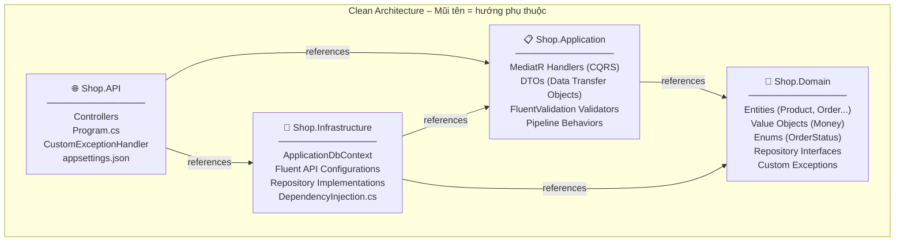
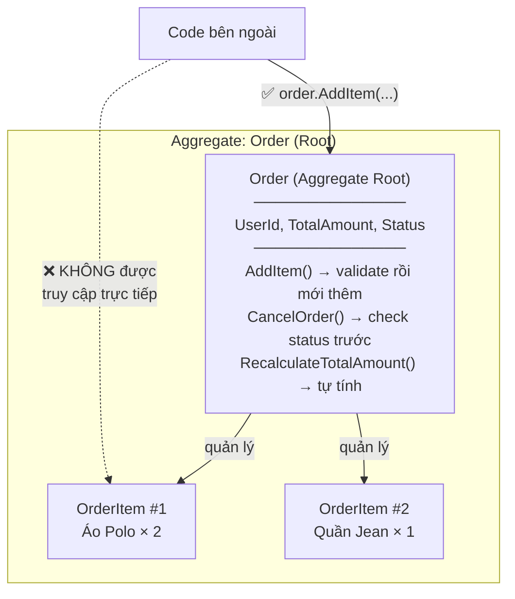
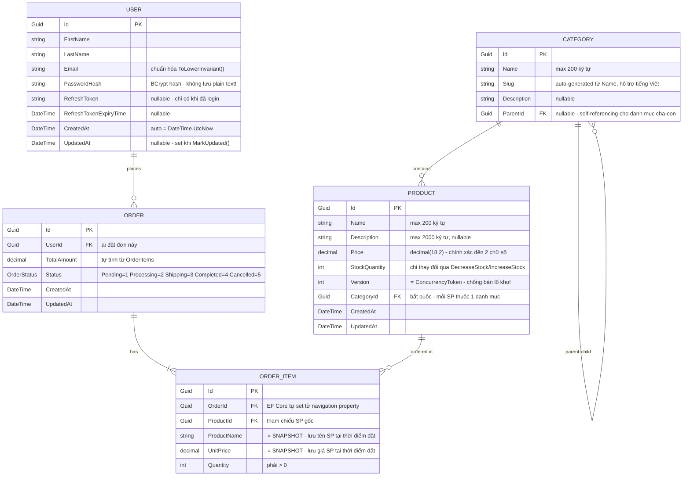
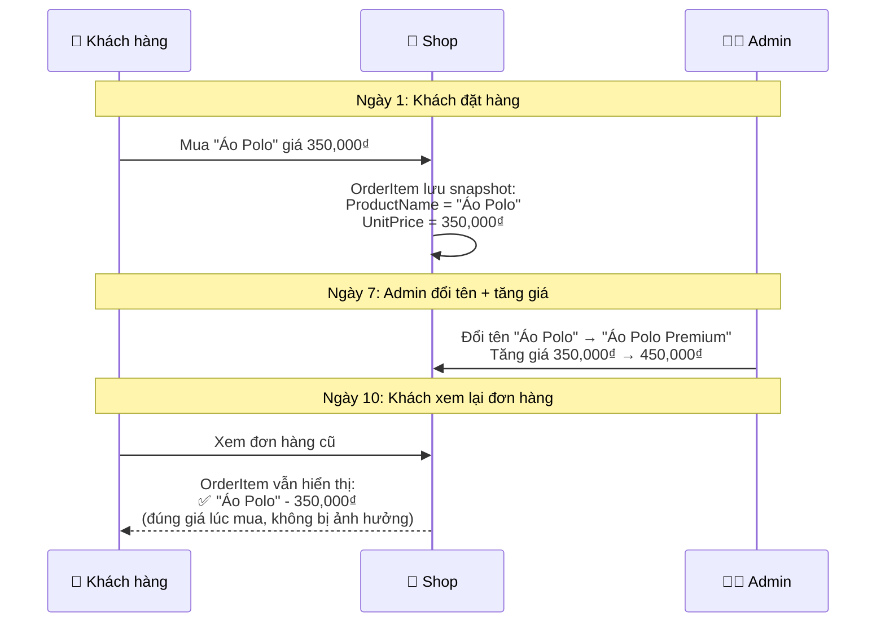
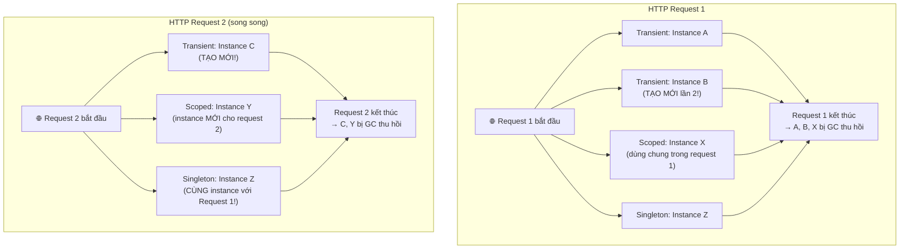
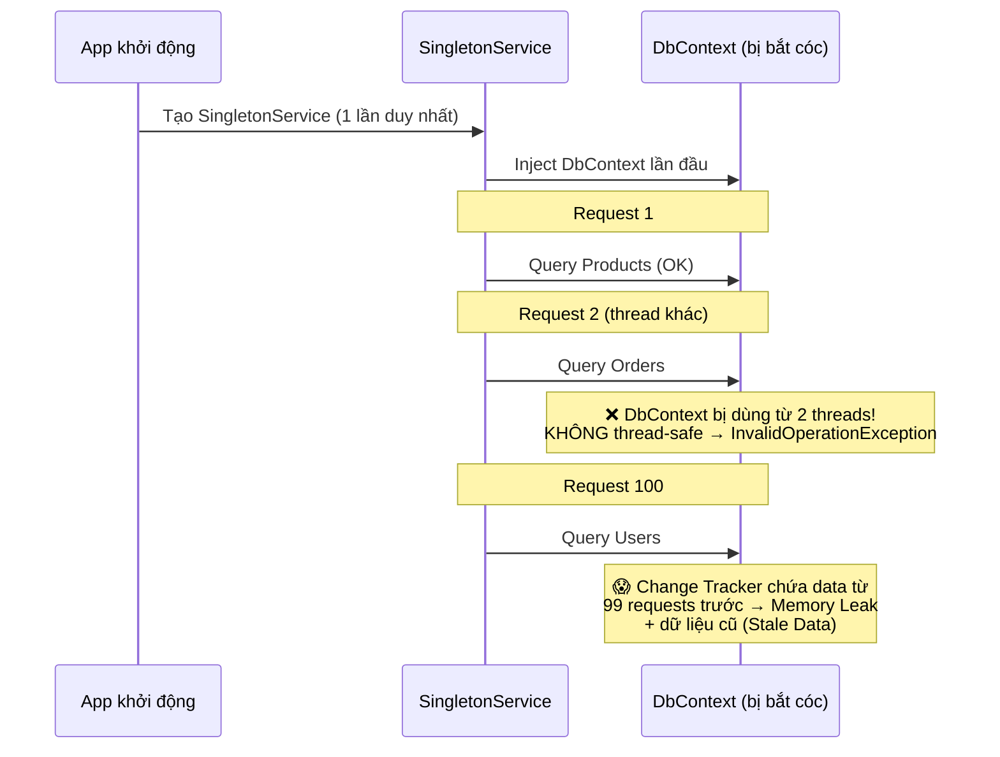
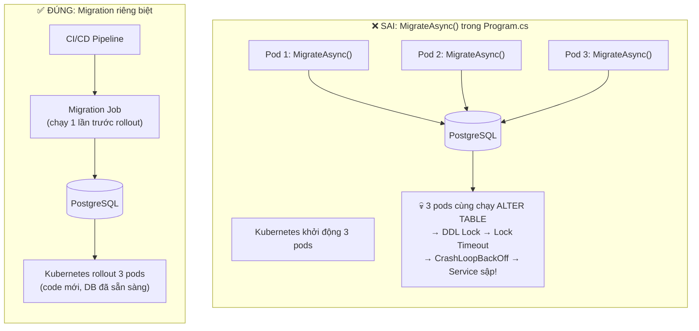
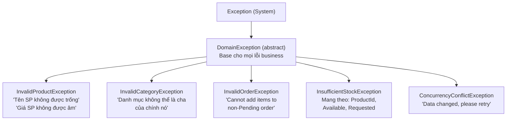

# 📅 NGÀY 1: SOLUTION SETUP & DOMAIN LAYER (Clean Architecture)

> **Mục tiêu:** Khởi tạo Solution và thiết kế tầng Core không phụ thuộc vào bất kỳ thư viện ngoài nào.  
> **Trạng thái:** ✅ Hoàn thành

---

## 1. CLEAN ARCHITECTURE – TẠI SAO VÀ NHƯ THẾ NÀO?

### 1.1 Vấn đề: Tại sao không viết tất cả trong 1 project?

Khi viết tất cả code vào 1 project duy nhất (Monolithic), bạn sẽ gặp các vấn đề:

- **Controller gọi thẳng DbContext** → Nếu đổi từ PostgreSQL sang MongoDB, phải sửa **toàn bộ** Controller
- **Business logic nằm rải rác** → Muốn unit test 1 rule thì phải setup cả database, HTTP server
- **Ai cũng phụ thuộc ai** → Sửa 1 chỗ, crash 10 chỗ khác

**Clean Architecture giải quyết bằng cách chia thành 4 tầng**, mỗi tầng có 1 trách nhiệm duy nhất, và chỉ phụ thuộc **hướng vào trong**:

### 1.2 Sơ đồ Dependency Direction



### 1.3 Giải thích chi tiết từng layer

#### 💎 Shop.Domain – Tầng trong cùng (KHÔNG phụ thuộc ai)

**Ví dụ thực tế:** Đây giống như **luật lệ của game cờ vua**. Dù bạn chơi trên bàn cờ gỗ, trên máy tính, hay trên điện thoại – luật vẫn vậy: "Vua đi 1 ô, Hậu đi mọi hướng". Luật **không cần biết** nền tảng chơi là gì.

```
Shop.Domain/
├── Common/
│   ├── BaseEntity.cs          ← Class cha chung: Id, CreatedAt, UpdatedAt
│   └── IAggregateRoot.cs      ← Marker interface đánh dấu Aggregate Root
├── Entities/
│   ├── Product.cs             ← Sản phẩm: DecreaseStock(), IncreaseStock()
│   ├── Category.cs            ← Danh mục: Rename(), MoveTo(), GenerateSlug()
│   ├── Order.cs               ← Đơn hàng: AddItem(), CancelOrder()
│   ├── OrderItem.cs           ← Chi tiết đơn: CalculateSubtotal()
│   └── User.cs                ← Người dùng: SetRefreshToken(), RevokeRefreshToken()
├── ValueObjects/
│   └── Money.cs               ← Tiền tệ (record immutable): Add(), Subtract()
├── Enums/
│   ├── OrderStatus.cs         ← Pending → Processing → Shipping → Completed/Cancelled
│   └── DiscountType.cs        ← Percentage | FixedAmount
├── Exceptions/
│   ├── DomainException.cs     ← Base class cho mọi lỗi business
│   ├── InvalidProductException.cs
│   ├── InvalidCategoryException.cs
│   ├── InvalidOrderException.cs
│   ├── InsufficientStockException.cs
│   └── ConcurrencyConflictException.cs
└── Repositories/
    ├── IGenericRepository.cs  ← Interface CRUD chung
    ├── IProductRepository.cs  ← Interface riêng cho Product
    ├── IOrderRepository.cs    ← Interface riêng cho Order
    └── IUnitOfWork.cs         ← Interface SaveChangesAsync()
```

**Quy tắc vàng:**
- ❌ **KHÔNG** có NuGet package ngoài (không EF Core, không MediatR, không HTTP)
- ❌ **KHÔNG** biết database là gì (PostgreSQL? MongoDB? File JSON? Không quan tâm!)
- ✅ **CHỈ** chứa business logic thuần túy bằng C# cơ bản

**Tại sao quan trọng?** Vì khi unit test, bạn chỉ cần `new Product(...)` rồi gọi `DecreaseStock()` → không cần setup database, không cần HTTP server, không cần bất cứ gì.

---

#### 📋 Shop.Application – Tầng Use Case

**Ví dụ thực tế:** Đây giống như **quản lý nhà hàng**. Quản lý biết: "Khách gọi món → bếp nấu → bưng ra". Nhưng quản lý **không biết** bếp dùng loại lò nào, cũng **không biết** database lưu ở đâu.

```
Shop.Application/
├── Products/
│   ├── Commands/
│   │   └── CreateProduct/     ← Tạo sản phẩm mới
│   └── Queries/
│       ├── GetProductsList/   ← Lấy danh sách SP (phân trang)
│       ├── GetProductById/    ← Lấy chi tiết 1 SP
│       └── ProductDto.cs      ← DTO trả về cho client
├── Orders/
│   ├── Commands/
│   │   ├── CreateOrder/       ← Tạo đơn hàng (xử lý concurrency)
│   │   └── CancelOrder/       ← Hủy đơn hàng
│   └── Queries/
│       └── GetOrderById/      ← Lấy chi tiết đơn hàng
├── Categories/
│   └── Commands/
│       └── CreateCategory/    ← Tạo danh mục mới
├── Common/
│   ├── Behaviors/
│   │   └── ValidationBehavior.cs  ← Chặn request nếu input không hợp lệ
│   └── PagedResult.cs             ← Generic wrapper phân trang
└── DependencyInjection.cs         ← Đăng ký MediatR + FluentValidation
```

**Quy tắc:**
- ✅ Biết `IProductRepository` (interface từ Domain) nhưng **KHÔNG biết** `GenericRepository` (implementation từ Infrastructure)
- ✅ Chỉ dùng MediatR, FluentValidation (thuộc Application layer)
- ❌ **KHÔNG** biết `ApplicationDbContext`, `DbSet<>`, `UseNpgsql()`

---

#### 🔧 Shop.Infrastructure – Tầng triển khai kỹ thuật

**Ví dụ thực tế:** Đây giống như **bếp nhà hàng**. Bếp biết cách nấu (EF Core queries), biết dùng lò nào (PostgreSQL), biết cách lưu trữ (Repository). Nhưng bếp **không ra tiếp khách** (không có Controller).

```
Shop.Infrastructure/
├── Persistence/
│   ├── ApplicationDbContext.cs     ← DbContext + implements IUnitOfWork
│   ├── Configurations/
│   │   ├── ProductConfiguration.cs     ← Fluent API cho bảng Product
│   │   ├── CategoryConfiguration.cs    ← Fluent API cho bảng Category
│   │   ├── OrderConfiguration.cs       ← Fluent API cho bảng Order
│   │   └── OrderItemConfiguration.cs   ← Fluent API cho bảng OrderItem
│   └── Migrations/                 ← EF Core migration files
├── Repositories/
│   ├── GenericRepository.cs        ← Triển khai IGenericRepository<T>
│   ├── ProductRepository.cs        ← Triển khai IProductRepository
│   └── OrderRepository.cs          ← Triển khai IOrderRepository
└── DependencyInjection.cs          ← Đăng ký DbContext + Repositories
```

---

#### 🌐 Shop.API – Tầng entry point

**Ví dụ thực tế:** Đây là **quầy lễ tân nhà hàng**. Lễ tân nhận yêu cầu từ khách → chuyển cho quản lý (MediatR) → quản lý chỉ đạo bếp → trả kết quả cho khách.

```
Shop.API/
├── Controllers/
│   ├── ProductsController.cs   ← POST/GET /api/products
│   └── OrdersController.cs     ← POST/GET /api/orders
├── Infrastructure/
│   └── CustomExceptionHandler.cs  ← Chuyển Exception → ProblemDetails (RFC 7807)
├── Program.cs                  ← Entry point: đăng ký services + middleware
├── appsettings.json            ← Connection string, config
└── Shop.API.csproj             ← References Application + Infrastructure
```

---

## 2. DOMAIN-DRIVEN DESIGN (DDD) – CÁC KHÁI NIỆM QUAN TRỌNG

### 2.1 Entity là gì?

**Entity** = Đối tượng có **identity** (định danh duy nhất). Hai entity có cùng data nhưng khác Id thì là **2 đối tượng khác nhau**.

**Ví dụ:** Hai chiếc áo polo cùng tên, cùng giá, cùng size → nhưng mã vạch (Id) khác nhau → là 2 sản phẩm khác nhau.

```csharp
// BaseEntity<TKey> – Class cha cho mọi Entity
public abstract class BaseEntity<TKey>
{
    public TKey Id { get; protected set; } = default!;     // Identity duy nhất
    public DateTime CreatedAt { get; protected set; } = DateTime.UtcNow;
    public DateTime? UpdatedAt { get; protected set; }

    protected void MarkUpdated() => UpdatedAt = DateTime.UtcNow;
    // MarkUpdated() chỉ gọi từ bên trong entity → đảm bảo UpdatedAt
    // luôn cập nhật khi có thay đổi, không ai "quên" set bên ngoài
}
```

### 2.2 Aggregate Root là gì?

**Aggregate Root** = Entity gốc quản lý một nhóm entity liên quan. Bên ngoài **chỉ tương tác qua Root**, không được truy cập trực tiếp entity con.

**Ví dụ thực tế:** Khi bạn đặt hàng trên Shopee:
- Bạn tương tác với **Đơn hàng** (Order = Aggregate Root)
- Bạn **KHÔNG** thêm OrderItem trực tiếp vào database. Bạn phải gọi `order.AddItem(...)` → Order tự quản lý items bên trong



**Code thực tế trong dự án:**

```csharp
public class Order : BaseEntity<Guid>, IAggregateRoot
{
    // _orderItems là private → bên ngoài KHÔNG thể thêm/xóa trực tiếp
    private readonly List<OrderItem> _orderItems = new();

    // Expose dưới dạng ReadOnly → chỉ đọc, không sửa
    public IReadOnlyCollection<OrderItem> OrderItems => _orderItems.AsReadOnly();

    public void AddItem(Guid productId, string productName, decimal unitPrice, int quantity)
    {
        // Validation: chỉ thêm khi đơn đang Pending
        if (Status != OrderStatus.Pending)
            throw new InvalidOrderException("Cannot add items to an order that is not Pending");

        // Validation: không thêm trùng sản phẩm
        if (_orderItems.Any(i => i.ProductId == productId))
            throw new InvalidOrderException("Product is already added to this order");

        // Thêm item + tự tính lại tổng tiền
        _orderItems.Add(new OrderItem(productId, productName, unitPrice, quantity));
        RecalculateTotalAmount();
        MarkUpdated();
    }
}
```

**Tại sao thiết kế như vậy?**
- `AddItem()` **validate trước khi thêm** → không bao giờ có đơn hàng với trạng thái bất hợp lệ
- `RecalculateTotalAmount()` **tự động gọi** → TotalAmount luôn đúng, không ai "quên" cập nhật
- `IReadOnlyCollection` → bên ngoài **không thể** `order.OrderItems.Add(...)` trực tiếp

### 2.3 IAggregateRoot – Marker Interface

```csharp
// Interface rỗng – chỉ dùng để "đánh dấu"
public interface IAggregateRoot { }
```

**Tại sao cần marker interface rỗng?** Để constraint Generic Repository:

```csharp
// Chỉ có Aggregate Root mới được có Repository riêng
public interface IGenericRepository<T> where T : BaseEntity<Guid>, IAggregateRoot
//                                                                 ^^^^^^^^^^^^^^
//                                      Constraint này ngăn ai đó tạo IGenericRepository<OrderItem>
//                                      vì OrderItem KHÔNG implement IAggregateRoot
```

### 2.4 Value Object là gì?

**Value Object** = Đối tượng **không có identity**, so sánh bằng **giá trị**. Hai Value Object có cùng data thì **bằng nhau**.

**Ví dụ:** Tờ tiền 100.000₫ trong ví bạn và tờ 100.000₫ trong ví tôi → **giá trị bằng nhau**, không cần phân biệt "tờ nào".

```csharp
// Dùng C# "record" thay vì "class"
// record tự sinh Equals() so sánh theo giá trị
public record Money
{
    public decimal Amount { get; }
    public string Currency { get; }

    public Money(decimal amount, string currency)
    {
        if (amount < 0)
            throw new ArgumentException("Số tiền không được âm.", nameof(amount));

        // ISO 4217: VND, USD, EUR → đúng 3 ký tự
        if (string.IsNullOrWhiteSpace(currency) || currency.Length != 3)
            throw new ArgumentException("Mã tiền tệ phải đúng 3 ký tự ISO 4217", nameof(currency));

        Amount = amount;
        Currency = currency.ToUpperInvariant(); // Chuẩn hóa: "vnd" → "VND"
    }

    // Factory method tiện dụng
    public static Money Vnd(decimal amount) => new(amount, "VND");

    // Phép toán có kiểm tra currency
    public Money Add(Money other)
    {
        if (other.Currency != Currency)
            throw new InvalidOperationException($"Không thể cộng {Currency} với {other.Currency}");
        return new Money(Amount + other.Amount, Currency);
    }

    // Vì dùng record → immutable → trả về object MỚI thay vì sửa object hiện tại
    public Money Multiply(int quantity) => new(Amount * quantity, Currency);
}
```

**Tại sao dùng `record` thay vì `class`?**

```csharp
// Với class → phải override Equals() thủ công
var a = new MoneyClass(100, "VND");
var b = new MoneyClass(100, "VND");
a == b  // false! (so sánh reference, không phải giá trị)

// Với record → C# tự sinh Equals() so sánh theo giá trị
var a = new Money(100, "VND");
var b = new Money(100, "VND");
a == b  // true! ✅ Đúng ý nghĩa Value Object
```

### 2.5 Sơ đồ quan hệ giữa các Entity (ERD)



### 2.6 Tại sao OrderItem lưu Snapshot?

**Tình huống thực tế:**



> **Nếu KHÔNG lưu snapshot** → đơn hàng cũ hiển thị tên mới + giá mới → khách hàng thắc mắc "tôi mua 350k sao giờ hiện 450k?"

### 2.7 Entity Product – Private Setter & Domain Method

```csharp
public sealed class Product : BaseEntity<Guid>, IAggregateRoot
{
    // Private setter → không ai set trực tiếp từ bên ngoài
    public string Name { get; private set; } = default!;
    public decimal Price { get; private set; }
    public int StockQuantity { get; private set; }
    public int Version { get; private set; }  // Concurrency Token

    // Private constructor cho EF Core (required)
    private Product() { }

    // Public constructor – VALIDATE ngay khi tạo
    public Product(string name, string? description, decimal price, int stockQuantity, Guid categoryId)
    {
        // ❌ Không cho phép tạo Product với data bất hợp lệ
        if (string.IsNullOrWhiteSpace(name))
            throw new InvalidProductException("Tên sản phẩm không được để trống");
        if (price < 0)
            throw new InvalidProductException("Giá sản phẩm không được âm");
        if (stockQuantity < 0)
            throw new InvalidProductException("Số lượng tồn kho không được âm");

        Id = Guid.NewGuid();  // Entity tự tạo Id
        Name = name.Trim();
        Price = price;
        StockQuantity = stockQuantity;
    }

    // Domain Method – thay đổi state phải qua đây
    public void DecreaseStock(int quantity)
    {
        if (quantity <= 0)
            throw new ArgumentOutOfRangeException(nameof(quantity));

        if (StockQuantity < quantity)
            throw new InsufficientStockException(Id, StockQuantity, quantity);
        //                                       ↑ exception mang theo context:
        //                                       "SP xxx còn 2, yêu cầu 5"

        StockQuantity -= quantity;
        Version++;        // ⭐ Tăng version mỗi lần thay đổi stock
        MarkUpdated();    // Set UpdatedAt = DateTime.UtcNow
    }
}
```

**Tại sao `private set` + Domain Method thay vì public set?**

```csharp
// ❌ SAI: Public setter → ai cũng set được → dễ có data bất hợp lệ
product.StockQuantity = -5;  // Không ai chặn!
product.StockQuantity -= 10; // Quên check stock đủ không!

// ✅ ĐÚNG: Domain Method → luôn validate trước khi thay đổi
product.DecreaseStock(10);
// → Nếu stock < 10 → throw InsufficientStockException
// → Version tự tăng → Concurrency Token được cập nhật
// → UpdatedAt tự set → không ai "quên"
```

---

## 3. DEPENDENCY INJECTION (DI) – SERVICE LIFETIMES

### 3.1 DI là gì?

**Ví dụ không có DI:**

```csharp
public class OrderService
{
    public void CreateOrder()
    {
        // ❌ OrderService tự tạo dependency → tightly coupled
        var db = new ApplicationDbContext("connection-string");
        var repo = new ProductRepository(db);
        // Nếu đổi database → sửa MỌI NƠI tạo ApplicationDbContext
    }
}
```

**Với DI:**

```csharp
public class OrderService
{
    private readonly IProductRepository _repo;  // Chỉ biết interface

    // ✅ Framework inject dependency vào → loosely coupled
    public OrderService(IProductRepository repo)
    {
        _repo = repo;
    }
    // Đổi database? Chỉ sửa 1 dòng trong DependencyInjection.cs
}
```

### 3.2 Ba loại Lifetime – Giải thích chi tiết



| Lifetime | Ví dụ thực tế | Dùng cho trong dự án |
|:---------|:-------------|:--------------------|
| **Transient** | Ly giấy dùng 1 lần – mỗi lần uống nước lấy ly mới | Lightweight services không giữ state |
| **Scoped** | Khay đồ ăn tự chọn – 1 khay cho 1 lượt ăn, ăn xong trả khay | **DbContext**, Repository, UnitOfWork |
| **Singleton** | Tivi trong quán – 1 cái cho cả quán, ai cũng xem chung | Configuration, ILogger, Cache service |

### 3.3 Lỗi Captive Dependency – Giải thích chi tiết

**Tình huống:** Bạn có 1 Singleton service (sống mãi) inject DbContext (Scoped, chết sau mỗi request):



**Giải pháp: Dùng `CreateScope()`**

```csharp
// Khi cần dùng Scoped service trong Singleton/Startup:
using var scope = app.Services.CreateScope();  // Tạo scope tạm
var db = scope.ServiceProvider.GetRequiredService<ApplicationDbContext>();
await db.Database.MigrateAsync();
// scope kết thúc → DbContext tự hủy ✅
```

### 3.4 Migration trong Production



---

## 4. EXCEPTION HIERARCHY – TẠI SAO CẦN?

### 4.1 Cây kế thừa Exception



**Tại sao tạo hierarchy thay vì dùng `Exception` chung?**

```csharp
// ❌ Không có hierarchy → phải check message string (dễ sai, khó maintain)
catch (Exception ex) when (ex.Message.Contains("stock"))  // 😱 Brittle!

// ✅ Có hierarchy → catch theo type, IDE autocomplete, compiler kiểm tra
catch (InsufficientStockException ex)
{
    // ex.ProductId, ex.Available, ex.Requested → có full context
    return StatusCode(400, $"SP {ex.ProductId} chỉ còn {ex.Available}");
}
```

---

## 📝 CÂU HỎI ÔN TẬP NGÀY 1

1. **Tại sao Shop.Domain KHÔNG reference EF Core?**
2. **Aggregate Root khác Entity thường ở điểm nào?**
3. **Tại sao dùng `record` cho Money thay vì `class`?**
4. **Giải thích lỗi Captive Dependency bằng lời của bạn.**
5. **Nếu OrderItem KHÔNG lưu snapshot giá, hậu quả là gì?**
6. **Tại sao `DecreaseStock()` có `Version++` bên trong?**

---

## 📝 TÓM TẮT NGÀY 1

**Đã tự tay viết:**
- 4 project: `Shop.Domain`, `Shop.Application`, `Shop.Infrastructure`, `Shop.API`
- 5 Entities: `Product`, `Category`, `Order`, `OrderItem`, `User`
- 1 Value Object: `Money` (record)
- 2 Enums: `OrderStatus`, `DiscountType`
- 2 Base classes: `BaseEntity<TKey>`, `IAggregateRoot`
- 6 Custom Exceptions
- 4 Repository Interfaces: `IGenericRepository<T>`, `IProductRepository`, `IOrderRepository`, `IUnitOfWork`

**Kiến thức cốt lõi:**
- Clean Architecture: 4 layers, dependency hướng vào trong
- DDD: Aggregate Root (quản lý nhóm entities), Value Object (so sánh bằng giá trị), Private setter + Domain Method
- DI Lifetimes: Transient (mới mỗi lần), Scoped (1/request), Singleton (1/app)
- Captive Dependency: Singleton inject Scoped → Memory Leak
- Exception Hierarchy: Class con → class cha, mang theo context
