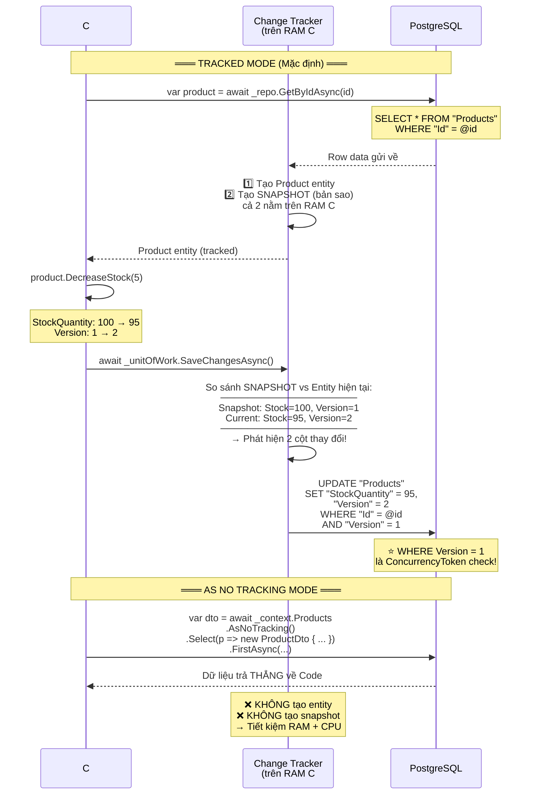
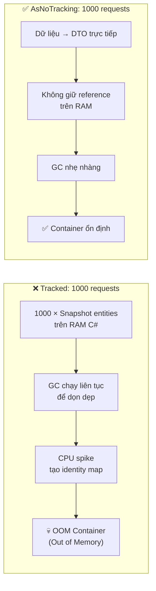
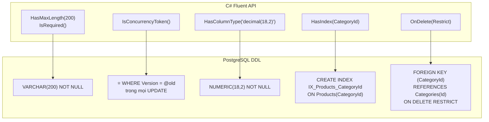
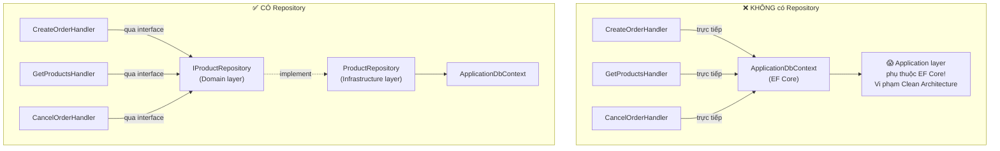
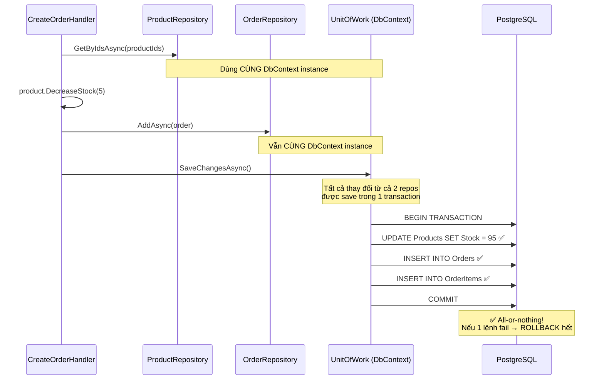
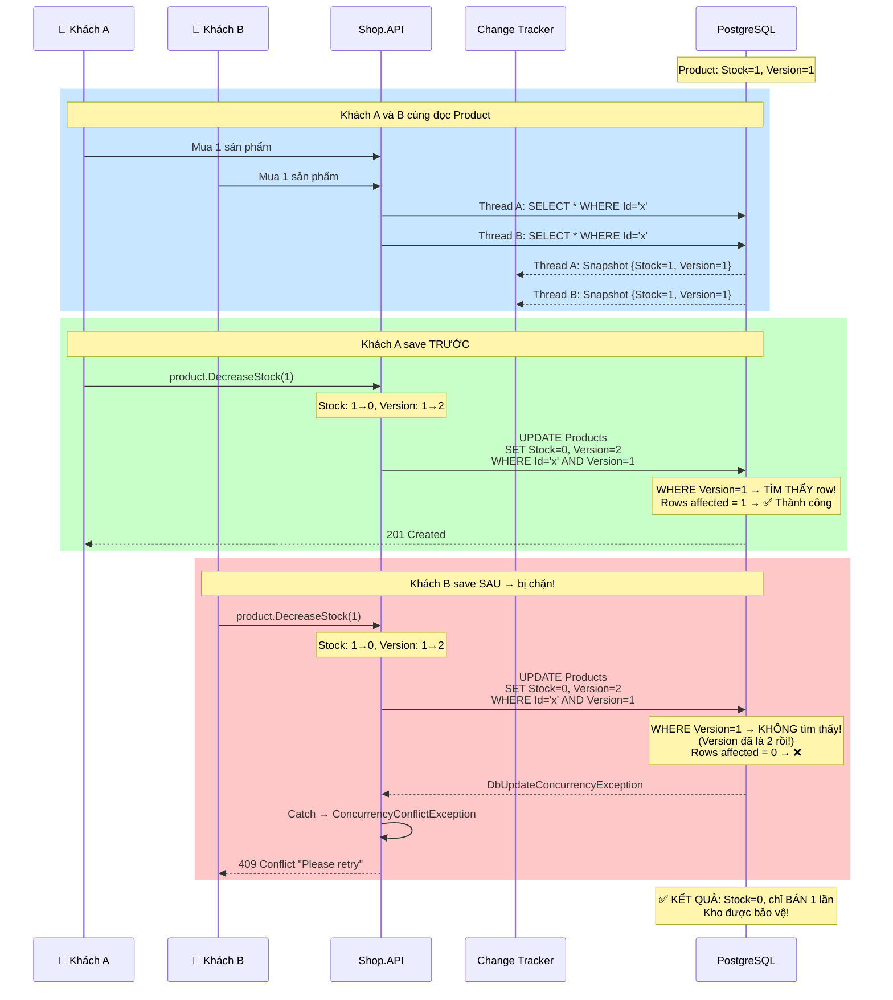
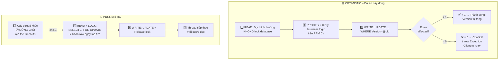
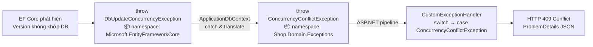

# 📅 NGÀY 2: PERSISTENCE LAYER & POSTGRESQL CONCURRENCY (EF Core)

> **Mục tiêu:** Cấu hình EF Core với PostgreSQL và tích hợp chống bán lố kho (Inventory Overselling).  
> **Trạng thái:** ✅ Hoàn thành

---

## 1. EF CORE CHANGE TRACKER – CƠ CHẾ HOẠT ĐỘNG CHI TIẾT

### 1.1 Change Tracker là gì?

**Ví dụ thực tế:** Bạn mở file Word, sửa vài chỗ, rồi nhấn Save. Word biết bạn sửa **chỗ nào** vì nó giữ bản gốc trong bộ nhớ → so sánh với bản hiện tại → chỉ lưu **phần thay đổi**.

EF Core cũng vậy! Khi bạn query 1 entity, EF Core tạo **Snapshot** (bản sao) trên **RAM C#** để theo dõi. Khi gọi `SaveChangesAsync()`, nó so sánh Snapshot vs Entity hiện tại → sinh lệnh SQL `UPDATE` chỉ cho **các cột đã thay đổi**.

### 1.2 Luồng hoạt động chi tiết



### 1.3 Tại sao AsNoTracking() quan trọng?

**Số liệu thực tế** (benchmark từ Microsoft docs):

| Metrics | Tracked | AsNoTracking() | Cải thiện |
|:--------|:--------|:---------------|:----------|
| **RAM** | 100 entity = ~50KB overhead | 0KB overhead | **Giảm 30-50%** |
| **CPU** | Tạo snapshot + identity map check | Bỏ qua hoàn toàn | **Nhanh hơn 20-40%** |
| **GC Pressure** | Nhiều object → GC chạy thường xuyên | Ít object → GC nhẹ nhàng | **Giảm đáng kể** |

**Khi 1000 users cùng GET /api/products:**



**Quy tắc áp dụng:**

```csharp
// ✅ GET API (Read-Only) → LUÔN dùng AsNoTracking
public async Task<ProductDto?> Handle(GetProductByIdQuery query, ...)
{
    return await _context.Products
        .AsNoTracking()                    // ← Bắt buộc cho query đọc
        .Where(p => p.Id == query.Id)
        .Select(p => new ProductDto { ... })
        .FirstOrDefaultAsync(cancellationToken);
}

// ✅ UPDATE/DELETE → KHÔNG dùng AsNoTracking (cần Change Tracker)
public async Task Handle(CreateOrderCommand command, ...)
{
    var product = await _repo.GetByIdAsync(productId);  // TRACKED!
    product.DecreaseStock(quantity);   // Change Tracker theo dõi thay đổi
    await _unitOfWork.SaveChangesAsync();  // Sinh UPDATE SQL từ snapshot
}
```

---

## 2. FLUENT API CONFIGURATION – CHI TIẾT

### 2.1 Tại sao dùng Fluent API thay Data Annotations?

```csharp
// ❌ Data Annotations → Domain Entity bị "dính" EF Core attributes
[Table("Products")]
[Index(nameof(CategoryId))]
public class Product
{
    [MaxLength(200)]
    [Required]
    public string Name { get; set; }

    [Column(TypeName = "decimal(18,2)")]
    public decimal Price { get; set; }
    // → Domain layer phải reference Microsoft.EntityFrameworkCore!
    //   Vi phạm Clean Architecture!
}

// ✅ Fluent API → Domain Entity sạch, config tách biệt ở Infrastructure
public class Product  // Clean! Không attribute nào của EF Core
{
    public string Name { get; private set; } = default!;
    public decimal Price { get; private set; }
}
```

### 2.2 ProductConfiguration – Giải thích từng dòng

```csharp
public class ProductConfiguration : IEntityTypeConfiguration<Product>
{
    public void Configure(EntityTypeBuilder<Product> builder)
    {
        // Primary Key
        builder.HasKey(p => p.Id);

        // Name: bắt buộc, tối đa 200 ký tự
        builder.Property(p => p.Name)
            .HasMaxLength(200)      // → VARCHAR(200) trong PostgreSQL
            .IsRequired();          // → NOT NULL

        // Description: tùy chọn, tối đa 2000 ký tự
        builder.Property(p => p.Description)
            .HasMaxLength(2000);    // → VARCHAR(2000), nullable mặc định

        // ⭐ CONCURRENCY TOKEN – Phần quan trọng nhất!
        builder.Property(p => p.Version)
            .IsConcurrencyToken()   // → EF Core thêm WHERE Version = @old vào UPDATE
            .IsRequired();

        // Price: decimal chính xác (18 digits, 2 decimal places)
        builder.Property(p => p.Price)
            .HasColumnType("decimal(18,2)")  // → NUMERIC(18,2) trong PostgreSQL
            .IsRequired();

        // StockQuantity: bắt buộc
        builder.Property(p => p.StockQuantity)
            .IsRequired();

        // Index trên CategoryId → tăng tốc JOIN khi query products theo category
        builder.HasIndex(p => p.CategoryId);
        // Không có index → PostgreSQL phải SCAN toàn bộ bảng (Full Table Scan)
        // Có index → PostgreSQL nhảy thẳng đến đúng vị trí (Index Seek)

        // Foreign Key: Product → Category (Restrict delete)
        builder.HasOne(p => p.Category)
               .WithMany()         // Category có nhiều Products (nhưng không cần navigation ngược)
               .HasForeignKey(p => p.CategoryId)
               .OnDelete(DeleteBehavior.Restrict);
        // Restrict = không cho xóa Category nếu còn Product thuộc nó
        // Cascade = xóa Category → tự xóa hết Products (NGUY HIỂM!)
    }
}
```

### 2.3 Sơ đồ SQL được sinh ra từ Configuration



### 2.4 Include() vs Select() – Giải thích bằng SQL

```csharp
// ❌ Code thừa: Include + Select
var products = await _context.Products
    .Include(p => p.Category)          // ← EF Core BỎ QUA dòng này!
    .Select(p => new ProductDto
    {
        Id = p.Id,
        Name = p.Name,
        CategoryName = p.Category.Name  // ← Select đã chỉ rõ cần gì
    })
    .ToListAsync();

// SQL sinh ra (CÓ hoặc KHÔNG có Include đều giống nhau):
// SELECT p."Id", p."Name", c."Name" AS "CategoryName"
// FROM "Products" p
// INNER JOIN "Categories" c ON p."CategoryId" = c."Id"
```

```csharp
// ✅ Đúng cách: Chỉ dùng Select (không cần Include)
var products = await _context.Products
    .AsNoTracking()
    .Select(p => new ProductDto
    {
        Id = p.Id,
        Name = p.Name,
        CategoryName = p.Category.Name  // EF Core tự sinh JOIN
    })
    .ToListAsync();
```

**Khi nào CẦN Include?** Khi bạn query entity (tracked) mà cần navigation property:

```csharp
// ✅ Cần Include khi query tracked entity
var order = await _context.Orders
    .Include(o => o.OrderItems)   // ← CẦN vì ta muốn duyệt OrderItems
    .FirstOrDefaultAsync(o => o.Id == orderId);

foreach (var item in order.OrderItems)  // Nếu không Include → OrderItems RỖNG!
{
    Console.WriteLine(item.ProductName);
}
```

---

## 3. REPOSITORY PATTERN – TRIỂN KHAI CHI TIẾT

### 3.1 Tại sao cần Repository Pattern?



### 3.2 GenericRepository – Code chi tiết

```csharp
public class GenericRepository<T> : IGenericRepository<T>
    where T : BaseEntity<Guid>, IAggregateRoot
{
    protected readonly ApplicationDbContext _context;
    protected readonly DbSet<T> _dbSet;

    public GenericRepository(ApplicationDbContext context)
    {
        _context = context;
        _dbSet = context.Set<T>();  // DbSet<Product>, DbSet<Order>, etc.
    }

    // TRACKED → dùng cho Command (Update/Delete)
    public async Task<T?> GetByIdAsync(Guid id, CancellationToken ct = default)
        => await _dbSet.FindAsync([id], ct);
    //                  ^^^^^^^^^ FindAsync dùng primary key → nhanh nhất
    //                  Kết quả được TRACK → SaveChangesAsync() sẽ phát hiện thay đổi

    // UNTRACKED → dùng cho Query (Read-Only)
    public async Task<T?> GetByIdAsNoTrackingAsync(Guid id, CancellationToken ct = default)
        => await _dbSet.AsNoTracking()
                       .FirstOrDefaultAsync(e => e.Id == id, ct);
    //                 ^^^^^^^^^^^^^^^ Không thể dùng FindAsync với AsNoTracking
    //                 vì FindAsync luôn check Change Tracker trước

    public async Task AddAsync(T entity, CancellationToken ct = default)
        => await _dbSet.AddAsync(entity, ct);
    //                  ^^^^^^^^ Chưa INSERT vào DB!
    //                  Chỉ đánh dấu entity là "Added" trong Change Tracker
    //                  Phải gọi SaveChangesAsync() để thực sự INSERT

    public void Update(T entity)
        => _dbSet.Update(entity);
    //          ^^^^^^^ Đánh dấu entity là "Modified"
    //          EF Core sẽ sinh UPDATE cho TẤT CẢ columns
    //          (Thực tế ít dùng vì Change Tracker tự phát hiện thay đổi)

    public void Delete(T entity)
        => _dbSet.Remove(entity);
    //          ^^^^^^^^ Đánh dấu "Deleted" → SaveChangesAsync() sinh DELETE
}
```

### 3.3 UnitOfWork – Tại sao cần và cách đăng ký đúng

**UnitOfWork là gì?** Đảm bảo tất cả thay đổi trong 1 business transaction được save **cùng lúc** hoặc **không save gì cả** (all-or-nothing).



**Đăng ký DI đúng cách:**

```csharp
// ✅ ĐÚNG: IUnitOfWork resolve CÙNG instance với DbContext
services.AddScoped<IUnitOfWork>(sp => sp.GetRequiredService<ApplicationDbContext>());
// GetRequiredService → lấy instance DbContext ĐÃ ĐĂNG KÝ, không tạo mới

// ❌ SAI: Tạo instance MỚI → 2 DbContext khác nhau!
services.AddScoped<IUnitOfWork, ApplicationDbContext>();
// ApplicationDbContext #1 = repos dùng (có data)
// ApplicationDbContext #2 = UnitOfWork dùng (RỖNG!)
// → SaveChangesAsync() save trên #2 → không có gì để save! 😱
```

---

## 4. OPTIMISTIC CONCURRENCY – CHỐNG BÁN LỐ KHO

### 4.1 Vấn đề: Race Condition là gì?

**Ví dụ thực tế:** Shopee Flash Sale – 1 chiếc iPhone còn lại, 10.000 người bấm mua cùng lúc.

Nếu không có cơ chế bảo vệ:
1. Thread A: Đọc Stock = 1, OK! → Giảm stock → Stock = 0
2. Thread B: Đọc Stock = 1 (chưa kịp thấy Thread A giảm!), OK! → Giảm stock → Stock = 0
3. → **Bán lố!** 2 người mua 1 sản phẩm!

### 4.2 Optimistic Concurrency giải quyết thế nào?



### 4.3 Code xử lý trong ApplicationDbContext

```csharp
public class ApplicationDbContext : DbContext, IUnitOfWork
{
    // Override SaveChangesAsync để TRANSLATE exception
    public new async Task<int> SaveChangesAsync(CancellationToken ct = default)
    {
        try
        {
            return await base.SaveChangesAsync(ct);
        }
        catch (DbUpdateConcurrencyException ex)
        {
            // TRANSLATE: EF Core exception → Domain exception
            // Tại sao? Vì Shop.Application KHÔNG reference EF Core
            // Nếu throw DbUpdateConcurrencyException → Application phải biết EF Core
            // → Vi phạm Clean Architecture!
            throw new ConcurrencyConflictException(
                "The data changed while your request was being processed. Please retry.", ex);
        }
    }
}
```

### 4.4 So sánh Optimistic vs Pessimistic – Chi tiết



| Tiêu chí | Optimistic | Pessimistic |
|:---------|:-----------|:------------|
| **Lock database** | ❌ Không lock | ✅ Lock row khi đọc |
| **Throughput** | ⚡ Cực cao (không ai chờ) | 🐌 Thấp (queue chờ lock) |
| **Khi xung đột** | Throw exception → client retry | Đứng chờ → có thể timeout |
| **Phù hợp khi** | Ít xung đột (Ecommerce: 99% Read) | Nhiều xung đột (ngân hàng, vé máy bay) |
| **DB Connection** | Giải phóng nhanh | Giữ lâu → dễ hết connection pool |
| **Cấu hình** | `IsConcurrencyToken()` trong Fluent API | `SELECT ... FOR UPDATE` trong raw SQL |

### 4.5 Luồng translate exception qua các layer



> **Tại sao translate?**
> - `DbUpdateConcurrencyException` thuộc EF Core → Application layer KHÔNG reference EF Core
> - `ConcurrencyConflictException` thuộc Domain → Application layer CÓ reference Domain
> - → Giữ đúng Clean Architecture boundary!

---

## 📝 CÂU HỎI ÔN TẬP NGÀY 2

1. **Snapshot của EF Core nằm ở đâu? DB hay RAM?**
2. **Khi nào dùng AsNoTracking(), khi nào KHÔNG dùng?**
3. **Tại sao dùng Fluent API thay Data Annotations?** (gợi ý: Clean Architecture)
4. **`IsConcurrencyToken()` sinh ra SQL gì?** (gợi ý: WHERE clause)
5. **Nếu dùng `AddScoped<IUnitOfWork, ApplicationDbContext>()` thay vì `GetRequiredService`, bug gì xảy ra?**
6. **Tại sao ApplicationDbContext phải translate `DbUpdateConcurrencyException` → `ConcurrencyConflictException`?**
7. **Giải thích bằng lời: Optimistic Concurrency ngăn bán lố kho như thế nào?**

---

## 📝 TÓM TẮT NGÀY 2

**Đã tự tay viết:**
- `ApplicationDbContext` (implements `IUnitOfWork`, catch + translate `DbUpdateConcurrencyException`)
- 4 Fluent API Configurations: Product (ConcurrencyToken), Category, Order, OrderItem
- 3 Repository Implementations: GenericRepository, ProductRepository, OrderRepository
- `DependencyInjection.cs` cho Infrastructure layer

**Kiến thức cốt lõi:**
- Change Tracker: Snapshot trên **RAM C#** (không phải DB!), so sánh khi SaveChanges
- AsNoTracking(): Bỏ snapshot → giảm 30-50% RAM → bắt buộc cho Read-Only queries
- Fluent API > Data Annotations: Giữ Domain Entity sạch, không dính EF Core
- IsConcurrencyToken(): Sinh `WHERE Version = @old` trong UPDATE → chống Race Condition
- UnitOfWork: `GetRequiredService` → cùng DbContext instance với Repositories
- Exception Translation: EF Core exception → Domain exception → giữ Clean Architecture

**Lỗi đã mắc:**
1. ❌ Nhầm Snapshot nằm dưới DB → ✅ Nằm trên RAM C#
2. ❌ Nhầm Caching với DB Locking → ✅ Hoàn toàn khác nhau
3. ❌ Tưởng Optimistic Concurrency vẫn overselling → ✅ EF Core quăng exception, hủy transaction
