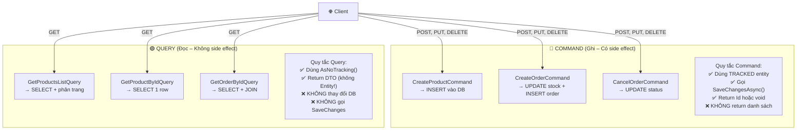
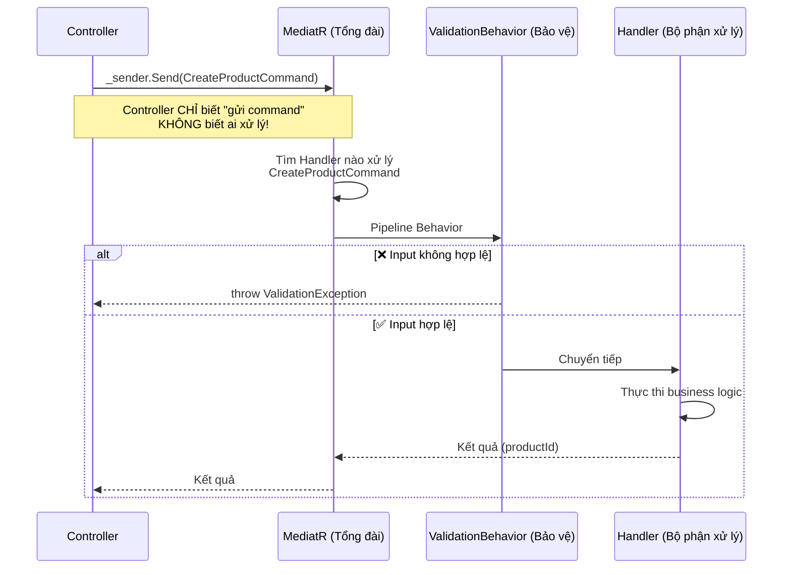
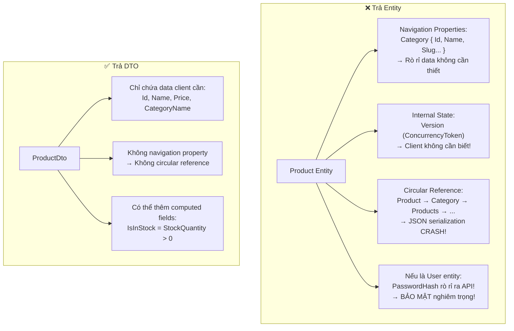

# 📅 NGÀY 3: CQRS PATTERN & MEDIATR LAYER

> **Mục tiêu:** Xây dựng luồng xử lý Command (Ghi) và Query (Đọc) tách biệt.  
> **Trạng thái:** ✅ Hoàn thành

---

## 1. CQRS LÀ GÌ? TẠI SAO CẦN?

### 1.1 Vấn đề: 1 method làm cả Read và Write

```csharp
// ❌ KHÔNG có CQRS: ProductService làm MỌI THỨ
public class ProductService
{
    public async Task<ProductDto> GetProduct(Guid id) { ... }      // Đọc
    public async Task<List<ProductDto>> SearchProducts(...) { ... } // Đọc
    public async Task<Guid> CreateProduct(...) { ... }              // Ghi
    public async Task UpdateProduct(...) { ... }                     // Ghi
    public async Task DeleteProduct(...) { ... }                     // Ghi
    // → 1 class chứa 5 methods → phình to khi thêm tính năng
    // → Tối ưu đọc (AsNoTracking) vs ghi (Tracked) lẫn lộn
    // → Unit test khó vì quá nhiều dependencies
}
```

### 1.2 CQRS tách biệt Read và Write

**CQRS = Command Query Responsibility Segregation**
(Tách biệt trách nhiệm giữa Command và Query)



**Lợi ích:**
- **Tối ưu riêng biệt:** Query dùng `AsNoTracking()` + `Select()` → nhanh. Command dùng Tracked → có Change Tracker
- **Dễ scale:** Có thể cho Query đọc từ Read Replica, Command ghi vào Primary DB
- **Dễ test:** Mỗi handler chỉ làm 1 việc → test cực kỳ đơn giản
- **Single Responsibility:** 1 class = 1 use case

---

## 2. MEDIATR – ĐIỀU PHỐI REQUEST

### 2.1 MediatR hoạt động như thế nào?

**Ví dụ thực tế:** MediatR giống như **tổng đài 1080**. Bạn gọi đến → nói yêu cầu → tổng đài chuyển đến **đúng bộ phận** xử lý → trả kết quả. Bạn KHÔNG CẦN BIẾT bộ phận nào xử lý.



### 2.2 Cấu trúc 1 Command handler đầy đủ

Mỗi Command/Query gồm **3 file** trong 1 folder:

```
Products/Commands/CreateProduct/
├── CreateProductCommand.cs     ← Request (input data)
├── CreateProductCommandHandler.cs  ← Handler (business logic)
└── CreateProductValidator.cs   ← Validator (FluentValidation)
```

**File 1: Command (Input)**

```csharp
// Command = "yêu cầu" gửi đến MediatR
// IRequest<Guid> = "tôi muốn nhận về 1 Guid (productId)"
public record CreateProductCommand(
    string Name,
    string? Description,
    decimal Price,
    int StockQuantity,
    Guid CategoryId
) : IRequest<Guid>;
// Dùng record → immutable, tự sinh Equals/GetHashCode
```

**File 2: Handler (Business Logic)**

```csharp
public class CreateProductCommandHandler : IRequestHandler<CreateProductCommand, Guid>
{
    private readonly IGenericRepository<Product> _repo;
    private readonly IUnitOfWork _unitOfWork;

    // DI inject dependencies
    public CreateProductCommandHandler(
        IGenericRepository<Product> repo,
        IUnitOfWork unitOfWork)
    {
        _repo = repo;
        _unitOfWork = unitOfWork;
    }

    public async Task<Guid> Handle(
        CreateProductCommand command,
        CancellationToken cancellationToken)
    {
        // 1️⃣ Tạo entity (Domain layer validate trong constructor)
        var product = new Product(
            command.Name,
            command.Description,
            command.Price,
            command.StockQuantity,
            command.CategoryId);

        // 2️⃣ Thêm vào Change Tracker (chưa INSERT vào DB!)
        await _repo.AddAsync(product, cancellationToken);

        // 3️⃣ Commit transaction (INSERT thực sự vào DB)
        await _unitOfWork.SaveChangesAsync(cancellationToken);

        // 4️⃣ Trả về Id cho Controller
        return product.Id;
    }
}
```

**File 3: Validator (FluentValidation)**

```csharp
public class CreateProductValidator : AbstractValidator<CreateProductCommand>
{
    public CreateProductValidator()
    {
        RuleFor(x => x.Name)
            .NotEmpty().WithMessage("Tên sản phẩm không được để trống")
            .MaximumLength(200).WithMessage("Tên không vượt quá 200 ký tự");

        RuleFor(x => x.Price)
            .GreaterThanOrEqualTo(0).WithMessage("Giá phải >= 0");

        RuleFor(x => x.StockQuantity)
            .GreaterThanOrEqualTo(0).WithMessage("Số lượng phải >= 0");

        RuleFor(x => x.CategoryId)
            .NotEqual(Guid.Empty).WithMessage("Phải chọn danh mục");
    }
}
```

### 2.3 Cấu trúc 1 Query handler

```csharp
// Query = "câu hỏi" → trả về DTO, KHÔNG thay đổi DB
public record GetProductsListQuery(int Page, int PageSize) : IRequest<PagedResult<ProductDto>>;

public class GetProductsListQueryHandler
    : IRequestHandler<GetProductsListQuery, PagedResult<ProductDto>>
{
    private readonly ApplicationDbContext _context;
    // ⚠️ Query có thể dùng DbContext trực tiếp (không bắt buộc qua Repository)
    // vì query phức tạp cần LINQ linh hoạt

    public async Task<PagedResult<ProductDto>> Handle(
        GetProductsListQuery query, CancellationToken ct)
    {
        var dbQuery = _context.Products
            .AsNoTracking()            // ← ⭐ Bắt buộc cho Query!
            .OrderByDescending(p => p.CreatedAt);

        var totalCount = await dbQuery.CountAsync(ct);

        var items = await dbQuery
            .Skip((query.Page - 1) * query.PageSize)   // Phân trang
            .Take(query.PageSize)
            .Select(p => new ProductDto                  // ← Projection sang DTO
            {
                Id = p.Id,
                Name = p.Name,
                Price = p.Price,
                StockQuantity = p.StockQuantity,
                CategoryName = p.Category.Name          // EF Core tự sinh JOIN!
            })
            .ToListAsync(ct);

        return new PagedResult<ProductDto>(items, totalCount, query.Page, query.PageSize);
    }
}
```

---

## 3. LUỒNG TẠO ĐƠN HÀNG – END-TO-END CHI TIẾT

### 3.1 Đây là handler phức tạp nhất – có xử lý Concurrency

```mermaid
sequenceDiagram
    participant Client as 🌐 Client
    participant Ctrl as OrdersController
    participant Med as MediatR
    participant VB as ValidationBehavior
    participant Handler as CreateOrderHandler
    participant ProdRepo as ProductRepository
    participant Product as Product Entity
    participant Order as Order Entity
    participant UoW as UnitOfWork
    participant DB as PostgreSQL

    Client->>Ctrl: POST /api/orders<br/>{ userId: "xxx",<br/>  items: [{ productId: "abc", quantity: 2 }] }
    Ctrl->>Med: _sender.Send(command)
    Med->>VB: Validate input

    Note over VB: Kiểm tra:<br/>✅ UserId không empty<br/>✅ Items không rỗng<br/>✅ Quantity > 0

    VB->>Handler: Input hợp lệ → chuyển tiếp

    Note over Handler: productIds = Items.Select(i => i.ProductId).Distinct()

    Handler->>ProdRepo: GetByIdsAsync(productIds)
    Note over ProdRepo: ⭐ BATCH – 1 round trip cho cả đơn hàng<br/>⚠️ TRACKED! Không dùng AsNoTracking<br/>vì cần update stock!
    ProdRepo->>DB: SELECT * FROM "Products" WHERE "Id" = ANY(@ids)
    DB-->>Handler: List&lt;Product&gt; (tracked) → ToDictionary(p => p.Id)

    Handler->>Order: new Order(userId)
    Note over Order: Id = Guid.NewGuid()<br/>Status = Pending<br/>TotalAmount = 0

    loop Với mỗi item trong command.Items
        alt Product không có trong dictionary
            Handler-->>Client: throw InvalidOrderException → 400
        end

        Handler->>Product: DecreaseStock(quantity)
        Note over Product: Kiểm tra stock >= quantity ✅<br/>StockQuantity -= quantity<br/>Version++ (concurrency token)

        Handler->>Order: AddItem(product.Id, product.Name, product.Price, qty)
        Note over Order: ⭐ Name/Price lấy từ DB, KHÔNG từ request<br/>Validate: Status == Pending ✅<br/>Validate: Không trùng productId ✅<br/>_orderItems.Add(new OrderItem(...))<br/>RecalculateTotalAmount()
    end

    Handler->>UoW: SaveChangesAsync()

    alt ✅ Version khớp (không ai sửa Product giữa chừng)
        UoW->>DB: BEGIN TRANSACTION
        UoW->>DB: UPDATE Products SET Stock=@new, Version=@new<br/>WHERE Id=@id AND Version=@old
        Note over DB: Rows affected = 1 ✅
        UoW->>DB: INSERT INTO Orders (...)
        UoW->>DB: INSERT INTO OrderItems (...)
        UoW->>DB: COMMIT
        Handler-->>Ctrl: orderId
        Ctrl-->>Client: 201 Created { id: "orderId" }
    else ❌ Version không khớp (Race Condition!)
        UoW->>DB: UPDATE ... WHERE Version=@old
        Note over DB: Rows affected = 0 ❌
        DB-->>UoW: DbUpdateConcurrencyException
        UoW-->>Handler: ConcurrencyConflictException
        Handler-->>Client: 409 Conflict "Please retry"
    end
```

---

## 4. CONTROLLER – MỎN MANH NHƯ THẾ NÀO?

### 4.1 ProductsController – Không có business logic

```csharp
[ApiController]
[Route("api/[controller]")]
public class ProductsController : ControllerBase
{
    private readonly ISender _sender;
    // ISender = MediatR interface, chỉ có 1 method: Send()

    public ProductsController(ISender sender) => _sender = sender;

    [HttpPost]
    [ProducesResponseType(StatusCodes.Status201Created)]
    [ProducesResponseType(StatusCodes.Status400BadRequest)]
    public async Task<IActionResult> Create(
        CreateProductCommand command,       // ASP.NET tự bind JSON body vào record
        CancellationToken cancellationToken)
    {
        // Controller chỉ có 2 dòng:
        var productId = await _sender.Send(command, cancellationToken);  // 1: Gửi command
        return CreatedAtAction(                                           // 2: Trả response
            nameof(GetById),
            new { id = productId },
            new { id = productId });
        // CreatedAtAction → 201 Created + Location header:
        // Location: /api/products/{productId}
    }

    [HttpGet]
    public async Task<ActionResult<PagedResult<ProductDto>>> GetAll(
        [FromQuery] int page = 1,           // Đọc từ query string: ?page=2&pageSize=10
        [FromQuery] int pageSize = 20,
        CancellationToken cancellationToken = default)
    {
        var result = await _sender.Send(
            new GetProductsListQuery(page, pageSize), cancellationToken);
        return Ok(result);
    }

    [HttpGet("{id:guid}")]
    // {id:guid} = route constraint → chỉ match Guid format
    // /api/products/abc → 404 (không phải Guid)
    // /api/products/550e8400-e29b-41d4-a716-446655440000 → OK
    public async Task<ActionResult<ProductDto>> GetById(
        Guid id, CancellationToken cancellationToken)
    {
        var product = await _sender.Send(
            new GetProductByIdQuery(id), cancellationToken);
        return product is null ? NotFound() : Ok(product);
    }
}
```

**Tại sao Controller mỏng?**
- Controller chỉ **nhận request** → **chuyển cho MediatR** → **trả response**
- **KHÔNG** có if/else logic, **KHÔNG** gọi repository, **KHÔNG** validate
- → Dễ test, dễ đọc, dễ maintain
- → Nếu muốn chuyển từ REST API sang gRPC → chỉ đổi Controller, Handler giữ nguyên!

---

## 5. DTO & PHÂN TRANG

### 5.1 Tại sao KHÔNG trả Entity ra ngoài?



### 5.2 PagedResult – Generic wrapper

```csharp
// Dùng cho MỌI query cần phân trang
public record PagedResult<T>(
    IReadOnlyList<T> Items,    // Danh sách items trang hiện tại
    int TotalCount,            // Tổng số items trong DB
    int Page,                  // Trang hiện tại
    int PageSize               // Số items mỗi trang
)
{
    // Computed property: tổng số trang
    public int TotalPages => (int)Math.Ceiling((double)TotalCount / PageSize);
}

// Ví dụ response:
// GET /api/products?page=2&pageSize=20
// {
//   "items": [ { "id": "...", "name": "Áo Polo" }, ... ],  // 20 items
//   "totalCount": 150,     // Có 150 sản phẩm trong DB
//   "page": 2,             // Đang xem trang 2
//   "pageSize": 20,        // Mỗi trang 20 items
//   "totalPages": 8        // 150 / 20 = 7.5 → ceil = 8 trang
// }
```

### 5.3 DI Registration – AddApplication()

```csharp
public static class DependencyInjection
{
    public static IServiceCollection AddApplication(this IServiceCollection services)
    {
        // MediatR: Scan assembly → tìm tất cả IRequestHandler → đăng ký tự động
        services.AddMediatR(cfg =>
        {
            cfg.RegisterServicesFromAssembly(typeof(DependencyInjection).Assembly);
            // ↑ Scan assembly chứa class này → tìm:
            //   - CreateProductCommandHandler
            //   - GetProductsListQueryHandler
            //   - ... tất cả handlers

            cfg.AddOpenBehavior(typeof(ValidationBehavior<,>));
            // ↑ Thêm ValidationBehavior vào pipeline
            //   Mọi request đều qua đây TRƯỚC khi đến Handler
        });

        // FluentValidation: Scan assembly → tìm tất cả AbstractValidator → đăng ký
        services.AddValidatorsFromAssembly(typeof(DependencyInjection).Assembly);
        // ↑ Tìm: CreateProductValidator, CreateOrderValidator, ...

        return services;
    }
}
```

---

## 📝 CÂU HỎI ÔN TẬP NGÀY 3

1. **Command khác Query ở điểm nào? Nêu 3 điểm.**
2. **Tại sao Query handler có thể dùng DbContext trực tiếp mà Command nên dùng Repository?**
3. **Controller có nên chứa if/else validation logic không? Tại sao?**
4. **Nếu trả Entity `User` ra API response, rủi ro bảo mật gì?**
5. **`CreatedAtAction()` trả về HTTP status code gì và có gì đặc biệt?** (gợi ý: Location header)
6. **MediatR biết handler nào xử lý command nào bằng cách nào?** (gợi ý: assembly scanning + generic matching)

---

## 📝 TÓM TẮT NGÀY 3

**Đã tự tay viết:**
- 4 Command Handlers: CreateProduct, CreateOrder, CancelOrder, CreateCategory
- 3 Query Handlers: GetProductsList (phân trang), GetProductById, GetOrderById
- DTOs: ProductDto, OrderDto
- PagedResult&lt;T&gt; generic wrapper
- 2 Controllers: ProductsController, OrdersController (mỏng – chỉ Send + return)

**Kiến thức cốt lõi:**
- CQRS: Command (Write, Tracked, SaveChanges) vs Query (Read, AsNoTracking, DTO)
- MediatR: Controller → Send() → Pipeline Behaviors → Handler
- Controller mỏng: Chỉ nhận request + trả response, KHÔNG có business logic
- DTO Projection: `.Select()` tự sinh JOIN, Entity KHÔNG BAO GIỜ trả ra API
- Phân trang: `PagedResult<T>` with Skip/Take
