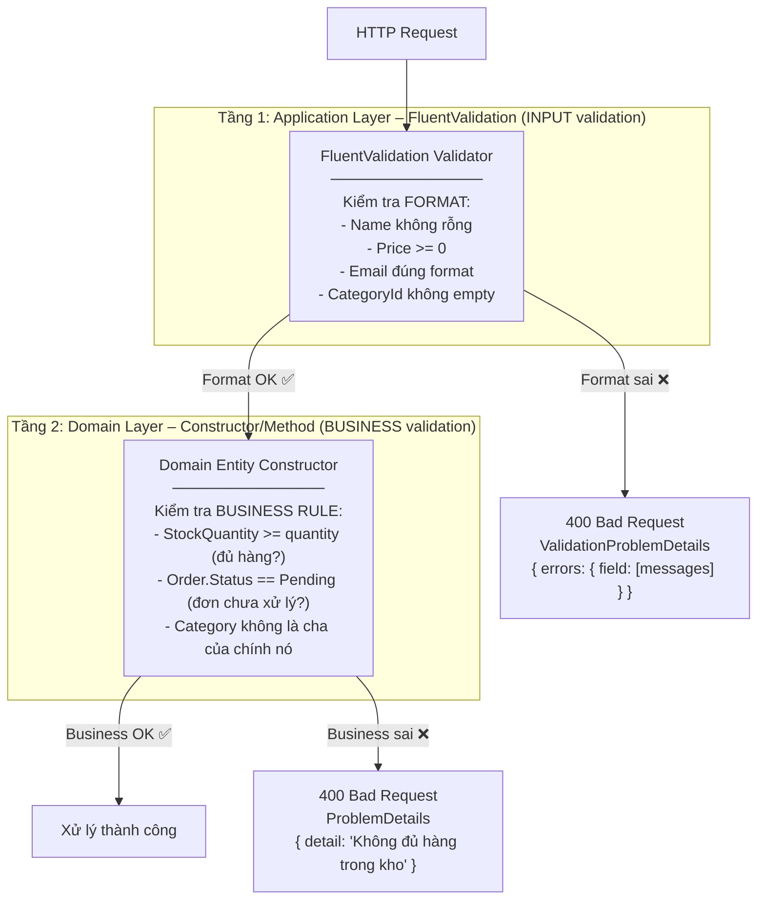
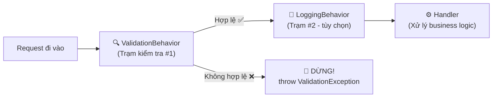
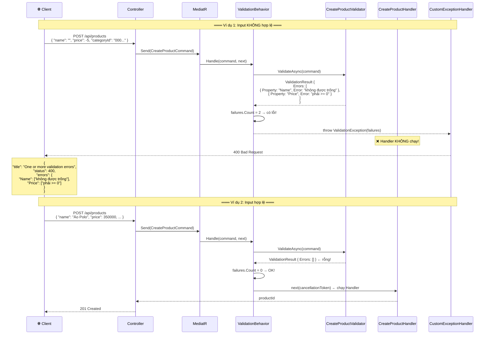
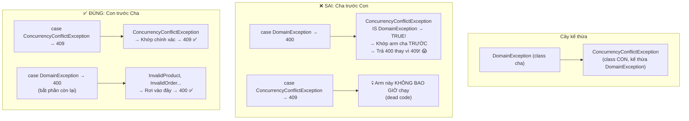
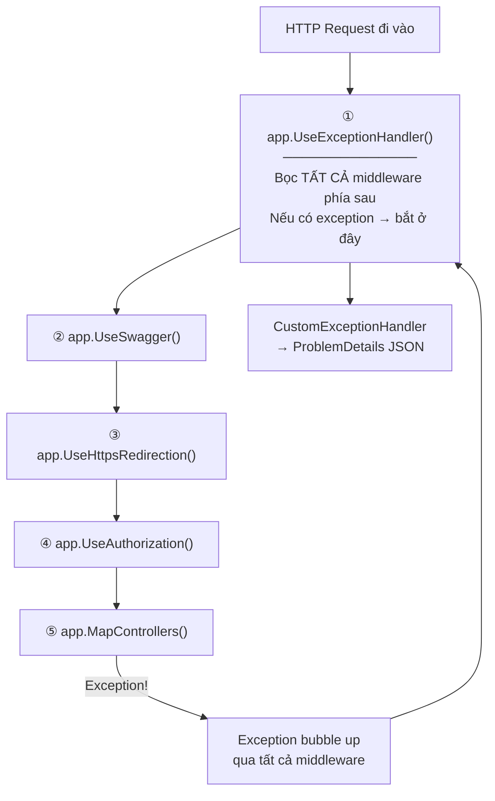
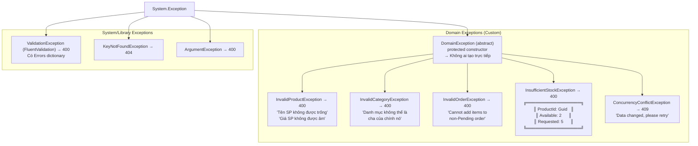

# 📅 NGÀY 4: VALIDATION & GLOBAL EXCEPTION HANDLING

> **Mục tiêu:** Chuẩn hóa validation và xử lý lỗi tập trung chuẩn RFC 7807.  
> **Trạng thái:** ✅ Hoàn thành

---

## 1. VALIDATION – TẠI SAO VALIDATE Ở 2 TẦNG?

### 1.1 Hai tầng validation trong dự án



**Tại sao cần 2 tầng?**

| Tầng | Kiểm tra gì | Ví dụ | Khi nào chạy |
|:-----|:------------|:------|:-------------|
| **FluentValidation** | Format, data type, required fields | "Name rỗng", "Price âm" | **Trước** khi Handler chạy (Pipeline) |
| **Domain Entity** | Business logic, invariants | "Hết hàng", "Đơn đã hoàn thành không hủy được" | **Trong** Handler khi gọi domain method |

**Ví dụ thực tế:** Đi khám bệnh:
- **Lễ tân** (FluentValidation): Kiểm tra CMND, sổ khám, hẹn trước → "Anh thiếu CMND"
- **Bác sĩ** (Domain): Khám → "Bệnh này không dùng thuốc A được vì anh dị ứng"

---

## 2. VALIDATIONBEHAVIOR – PIPELINE CỦA MEDIATR

### 2.1 IPipelineBehavior là gì?

**Ví dụ thực tế:** MediatR Pipeline giống như **dây chuyền sản xuất**. Request đi qua từng **trạm kiểm tra** trước khi đến Handler. Nếu 1 trạm phát hiện lỗi → dừng ngay, không chạy tiếp.



### 2.2 Code ValidationBehavior – Giải thích chi tiết từng dòng

```csharp
public class ValidationBehavior<TRequest, TResponse> : IPipelineBehavior<TRequest, TResponse>
    where TRequest : notnull
//  ↑ Generic: hoạt động với BẤT KỲ Request nào (CreateProductCommand, GetProductsQuery...)
{
    // DI inject TẤT CẢ validators đăng ký cho TRequest
    // Ví dụ: TRequest = CreateProductCommand
    // → _validators = [ CreateProductValidator ]
    private readonly IEnumerable<IValidator<TRequest>> _validators;

    public ValidationBehavior(IEnumerable<IValidator<TRequest>> validators)
    {
        _validators = validators;
        // Nếu không có validator nào cho request này → _validators rỗng (OK, không lỗi)
    }

    public async Task<TResponse> Handle(
        TRequest request,
        RequestHandlerDelegate<TResponse> next,  // ← "next" = Handler thực sự
        CancellationToken cancellationToken)
    {
        // Nếu không có validator nào → bỏ qua, chạy Handler luôn
        if (!_validators.Any())
            return await next(cancellationToken);
        //                  ↑ Gọi Handler (hoặc Behavior tiếp theo trong pipeline)

        // Tạo validation context
        var context = new ValidationContext<TRequest>(request);

        // Chạy TẤT CẢ validators SONG SONG (Task.WhenAll)
        var results = await Task.WhenAll(
            _validators.Select(v => v.ValidateAsync(context, cancellationToken)));
        //                          ↑ Mỗi validator trả về ValidationResult

        // Gom tất cả lỗi từ tất cả validators
        var failures = results
            .SelectMany(result => result.Errors)   // Flatten: [[lỗi1, lỗi2], [lỗi3]] → [lỗi1, lỗi2, lỗi3]
            .Where(failure => failure is not null)
            .ToList();

        // Nếu CÓ lỗi → throw, Handler KHÔNG BAO GIỜ chạy
        if (failures.Count != 0)
            throw new ValidationException(failures);
        //  ↑ FluentValidation.ValidationException (KHÔNG phải System.ComponentModel)
        //  CustomExceptionHandler sẽ bắt exception này → trả 400

        // Không lỗi → chạy Handler
        return await next(cancellationToken);
    }
}
```

### 2.3 Luồng hoạt động chi tiết – Ví dụ thực tế



---

## 3. CUSTOM EXCEPTION HANDLER – XỬ LÝ LỖI TẬP TRUNG

### 3.1 Vấn đề: Tại sao cần xử lý lỗi tập trung?

```csharp
// ❌ KHÔNG có ExceptionHandler → try/catch ở TỪNG Controller
[HttpPost]
public async Task<IActionResult> Create(CreateProductCommand command)
{
    try
    {
        var id = await _sender.Send(command);
        return CreatedAtAction(nameof(GetById), new { id }, new { id });
    }
    catch (ValidationException ex)
    {
        return BadRequest(new { errors = ex.Errors });  // Copy-paste ở mọi endpoint!
    }
    catch (DomainException ex)
    {
        return BadRequest(new { detail = ex.Message });  // Copy-paste!
    }
    catch (KeyNotFoundException ex)
    {
        return NotFound(new { detail = ex.Message });    // Copy-paste!
    }
    // 😱 10 endpoints = 10 lần copy-paste try/catch
    // Quên 1 chỗ → 500 Internal Server Error → rò rỉ stack trace!
}

// ✅ CÓ ExceptionHandler → Controller sạch
[HttpPost]
public async Task<IActionResult> Create(CreateProductCommand command)
{
    var id = await _sender.Send(command);  // Không try/catch!
    return CreatedAtAction(nameof(GetById), new { id }, new { id });
    // Nếu exception xảy ra → CustomExceptionHandler tự bắt
}
```

### 3.2 CustomExceptionHandler – Code chi tiết

```csharp
public class CustomExceptionHandler : IExceptionHandler
// IExceptionHandler = .NET 8+ built-in interface
// ASP.NET tự gọi khi có exception chưa handled
{
    private readonly ILogger<CustomExceptionHandler> _logger;

    public CustomExceptionHandler(ILogger<CustomExceptionHandler> logger)
        => _logger = logger;

    public async ValueTask<bool> TryHandleAsync(
        HttpContext httpContext,
        Exception exception,
        CancellationToken cancellationToken)
    {
        // switch expression → match exception type → tạo ProblemDetails
        var problemDetails = exception switch
        {
            // ① FluentValidation errors → 400 + Errors dictionary
            ValidationException validationEx
                => BuildValidationProblem(validationEx),

            // ② Concurrency conflict → 409 (safe to retry)
            // ⚠️ PHẢI đặt TRƯỚC DomainException! (giải thích bên dưới)
            ConcurrencyConflictException conflictEx
                => new ProblemDetails
                {
                    Status = StatusCodes.Status409Conflict,
                    Title = "Concurrent modification",
                    Detail = conflictEx.Message
                },

            // ③ Tất cả DomainException khác → 400
            DomainException domainEx
                => new ProblemDetails
                {
                    Status = StatusCodes.Status400BadRequest,
                    Title = "Domain rule violated",
                    Detail = domainEx.Message
                },

            // ④ Not found → 404
            KeyNotFoundException notFoundEx
                => new ProblemDetails
                {
                    Status = StatusCodes.Status404NotFound,
                    Title = "Resource not found",
                    Detail = notFoundEx.Message
                },

            // ⑤ Invalid argument → 400
            ArgumentException argEx
                => new ProblemDetails
                {
                    Status = StatusCodes.Status400BadRequest,
                    Title = "Invalid argument",
                    Detail = argEx.Message
                },

            // ⑥ Unknown → return false → ASP.NET trả 500
            _ => null
        };

        if (problemDetails is null)
        {
            // Lỗi không xác định → log FULL exception (stack trace)
            // nhưng KHÔNG trả stack trace cho client (bảo mật!)
            _logger.LogError(exception, "Unhandled: {Message}", exception.Message);
            return false;  // false = "tôi không handle được" → ASP.NET trả 500
        }

        // Log lỗi đã handle (Warning level, không cần stack trace)
        _logger.LogWarning("Request failed: {Status} - {Detail}",
            problemDetails.Status, problemDetails.Detail);

        // Set response
        problemDetails.Instance = httpContext.Request.Path;
        httpContext.Response.StatusCode = problemDetails.Status!.Value;

        // ⭐ QUAN TRỌNG: Serialize bằng RUNTIME type
        await httpContext.Response.WriteAsJsonAsync(
            problemDetails,
            problemDetails.GetType(),  // ← Runtime type!
            options: null,
            cancellationToken);

        return true;  // true = "tôi đã handle xong"
    }

    private static ValidationProblemDetails BuildValidationProblem(
        ValidationException exception)
    {
        // Gom lỗi theo property name
        var errors = exception.Errors
            .GroupBy(e => e.PropertyName)
            .ToDictionary(
                g => g.Key,                                    // Key = "Name"
                g => g.Select(e => e.ErrorMessage).ToArray()); // Value = ["không rỗng", "max 200"]

        return new ValidationProblemDetails(errors)
        {
            Status = StatusCodes.Status400BadRequest,
            Title = "One or more validation errors occurred"
        };
    }
}
```

### 3.3 ⚠️ THỨ TỰ SWITCH – BẪY NGUY HIỂM



> **Quy tắc:** Trong C# `switch`, class **CON** phải đặt **TRƯỚC** class **CHA**. Vì C# khớp arm **đầu tiên** thỏa mãn. `ConcurrencyConflictException IS DomainException` → nếu `DomainException` đặt trước → nó "nuốt" hết exceptions con!

### 3.4 Kỹ thuật Serialization – GetType() là gì?

```csharp
// Problem: ProblemDetails có 2 class
// - ProblemDetails (base): { title, status, detail, instance }
// - ValidationProblemDetails (derived): { ...base + errors: {} }

ProblemDetails problem = BuildValidationProblem(ex);
// Biến khai báo là ProblemDetails (static type)
// Nhưng runtime object là ValidationProblemDetails (runtime type)

// ❌ SAI: Serialize theo static type
await response.WriteAsJsonAsync(problem);
// System.Text.Json thấy static type = ProblemDetails
// → Chỉ serialize { title, status, detail, instance }
// → MẤT property "errors"! 😱

// ✅ ĐÚNG: Serialize theo runtime type
await response.WriteAsJsonAsync(problem, problem.GetType());
// problem.GetType() = typeof(ValidationProblemDetails)
// → Serialize ĐẦY ĐỦ { title, status, detail, instance, errors }
```

---

## 4. RFC 7807 PROBLEMDETAILS – CHUẨN TRẢ LỖI

### 4.1 Tại sao cần chuẩn thay vì tự chế?

```csharp
// ❌ Tự chế → Frontend phải đoán cấu trúc
// API 1: { "error": "Not found" }
// API 2: { "message": "Invalid", "code": 400 }
// API 3: { "err": { "msg": "Bad" } }
// → Frontend phải viết 3 cách parse lỗi khác nhau! 😱

// ✅ RFC 7807 ProblemDetails → Chuẩn quốc tế, mọi API cùng format
// {
//   "type": "https://tools.ietf.org/html/rfc9110#section-15.5.1",
//   "title": "One or more validation errors occurred",
//   "status": 400,
//   "detail": "See errors for details",
//   "instance": "/api/products",
//   "errors": { "Name": ["required"], "Price": [">= 0"] }
// }
// → Frontend chỉ cần 1 cách parse cho MỌI API!
```

### 4.2 Ví dụ response cho từng loại lỗi

**400 – Validation Error:**
```json
{
  "type": "https://tools.ietf.org/html/rfc9110#section-15.5.1",
  "title": "One or more validation errors occurred",
  "status": 400,
  "instance": "/api/products",
  "errors": {
    "Name": ["Tên sản phẩm không được để trống"],
    "Price": ["Giá sản phẩm không được âm"],
    "CategoryId": ["Phải chọn danh mục"]
  }
}
```

**400 – Domain Rule Violation:**
```json
{
  "title": "Domain rule violated",
  "status": 400,
  "detail": "Sản phẩm abc123 không đủ hàng. Còn lại 2, yêu cầu 5",
  "instance": "/api/orders"
}
```

**404 – Not Found:**
```json
{
  "title": "Resource not found",
  "status": 404,
  "detail": "Product with Id 'xxx' was not found.",
  "instance": "/api/products/xxx"
}
```

**409 – Concurrency Conflict:**
```json
{
  "title": "Concurrent modification",
  "status": 409,
  "detail": "The data changed while your request was being processed. Please retry.",
  "instance": "/api/orders"
}
```

**500 – Unhandled (ASP.NET mặc định):**
```json
{
  "title": "An error occurred while processing your request.",
  "status": 500
}
```
> ⚠️ **KHÔNG** trả stack trace cho client ở production → bảo mật!

### 4.3 Middleware Pipeline – ExceptionHandler ở đâu?



> `UseExceptionHandler()` đặt **ĐẦU TIÊN** → bắt exception từ **MỌI** middleware phía sau, kể cả Swagger.

---

## 5. EXCEPTION HIERARCHY – CÂY KẾ THỪA CHI TIẾT

### 5.1 Sơ đồ + HTTP Status Mapping



### 5.2 InsufficientStockException – Mang theo context

```csharp
public class InsufficientStockException : DomainException
{
    // Properties mang theo context → debug dễ hơn
    public Guid ProductId { get; }
    public int Available { get; }
    public int Requested { get; }

    public InsufficientStockException(Guid productId, int available, int requested)
        : base($"Sản phẩm {productId} không đủ hàng. Còn lại {available}, yêu cầu {requested}")
    //       ↑ Message có đầy đủ thông tin → log + response đều rõ ràng
    {
        ProductId = productId;
        Available = available;
        Requested = requested;
    }
}

// Khi throw:
throw new InsufficientStockException(product.Id, product.StockQuantity, requestedQuantity);
// → Message: "Sản phẩm abc-123 không đủ hàng. Còn lại 2, yêu cầu 5"
// → CustomExceptionHandler → 400 ProblemDetails { detail: "..." }
```

---

## 📝 CÂU HỎI ÔN TẬP NGÀY 4

1. **Tại sao validate ở 2 tầng (FluentValidation + Domain) thay vì 1?**
2. **ValidationBehavior throw thay vì return → tại sao?** (gợi ý: CustomExceptionHandler)
3. **Trong switch expression, tại sao `ConcurrencyConflictException` phải đặt trước `DomainException`?**
4. **`WriteAsJsonAsync(obj, obj.GetType())` – nếu không truyền `GetType()` thì mất gì?**
5. **`UseExceptionHandler()` đặt ở đầu hay cuối pipeline? Tại sao?**
6. **InsufficientStockException có 3 properties (ProductId, Available, Requested) → lợi ích gì so với chỉ có Message string?**

---

## 📝 TÓM TẮT NGÀY 4

**Đã tự tay viết:**
- `ValidationBehavior<TRequest, TResponse>` (MediatR Pipeline – chặn request trước Handler)
- `CustomExceptionHandler` (IExceptionHandler – RFC 7807 ProblemDetails)
- 6 Custom Domain Exceptions (DomainException → 5 class con)

**Kiến thức cốt lõi:**
- 2 tầng validation: FluentValidation (format) → Domain (business rules)
- MediatR Pipeline: Behavior chạy TRƯỚC Handler, throw để chặn
- Exception Hierarchy: Class con TRƯỚC class cha trong switch
- RFC 7807 ProblemDetails: Chuẩn quốc tế, Frontend chỉ cần 1 parser
- Serialization: `GetType()` để giữ properties của derived class
- ExceptionHandler middleware: Đặt đầu pipeline, bắt mọi exception phía sau
