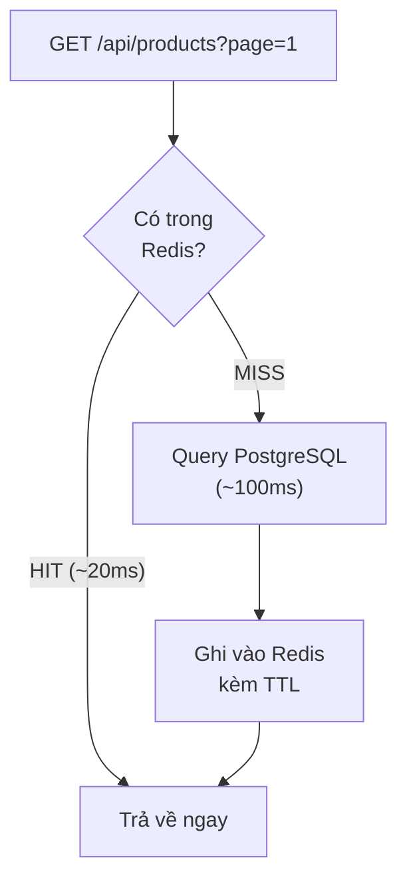
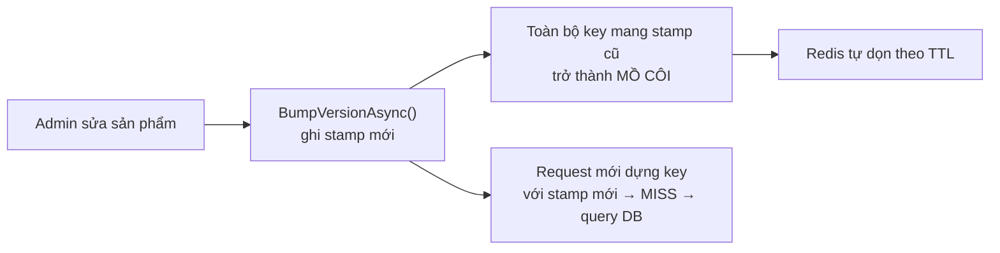
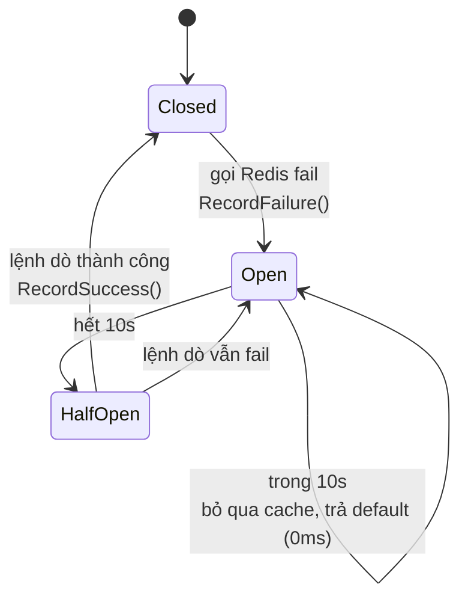

# 📅 NGÀY 7: REDIS CACHING & RESILIENCE

> **Mục tiêu:** Tăng tốc truy vấn đọc bằng Cache-Aside, và giữ cho hệ thống sống sót khi cache chết.
> **Trạng thái:** ✅ Đã code + đã đo bằng số thật

---

## 1. CACHE-ASIDE PATTERN

### 1.1 Ý tưởng

**Cache-Aside** (còn gọi *Lazy Loading*): ứng dụng **tự quản lý** cache, Redis chỉ là cái kho câm.

**Ví dụ thực tế:** Bạn tra từ điển:
- Nhìn vào **sổ tay ghi chú** trước (cache) → có thì dùng luôn
- Không có → mở **từ điển dày** (database) → tra xong **chép vào sổ tay** để lần sau khỏi mở lại



### 1.2 Vì sao là Cache-Aside chứ không phải kiểu khác

| Pattern | Ai ghi vào cache | Phù hợp |
|:--|:--|:--|
| **Cache-Aside** | Ứng dụng | Đọc nhiều hơn ghi — **ecommerce** |
| Write-Through | Cache tự ghi xuống DB | Cần cache luôn đồng bộ tuyệt đối |
| Write-Behind | Cache ghi xuống DB sau | Chịu được mất dữ liệu, cần ghi cực nhanh |

Cache-Aside có một tính chất quý: **cache chết thì hệ thống vẫn chạy**, chỉ chậm. Write-Through mà cache chết là mất luôn đường ghi.

---

## 2. INVALIDATION BẰNG VERSION STAMP

### 2.1 Bài toán

API phân trang có **N key** cho cùng một tập dữ liệu:

```
products:p1:s20
products:p2:s20
...
products:p2500:s20      ← 50.000 sản phẩm / 20 = 2500 trang
```

Admin sửa **một** sản phẩm → phải xóa **cả 2500 key**. Redis không có lệnh "xóa theo prefix" an toàn (`KEYS *` khóa cả server, `SCAN` thì chậm và không nguyên tử).

### 2.2 Giải pháp: nhúng version vào key

Giữ **một** key riêng làm mốc phiên bản, và nhét giá trị của nó vào mọi cache key:

```
ver:products = 639225340665804994          ← version stamp, KHÔNG TTL

products:v639225340665804994:p1:s20        ← key dữ liệu, TTL 2 phút
products:v639225340665804994:p2:s20
```

Khi admin ghi dữ liệu, chỉ cần **đổi stamp**:



**1 lệnh ghi vô hiệu hóa N trang.** Không duyệt, không xóa, không khóa.

### 2.3 Cái giá phải trả

- Key cũ vẫn chiếm RAM cho tới khi hết TTL → cần `maxmemory-policy allkeys-lru` (đã cấu hình trong `docker-compose.yml`)
- Mỗi request tốn **thêm 1 round-trip** để đọc stamp

### 2.4 ⚠️ Version stamp KHÔNG được đặt TTL

Nếu stamp hết hạn trước key dữ liệu → stamp mới sinh ra → **toàn bộ cache miss cùng lúc** → cả đàn request đổ xuống DB. Đó là **cache stampede**.

---

## 3. PORT THUỘC TẦNG NÀO? (CLEAN ARCHITECTURE)

Ban đầu tôi đặt `ICacheService` trong `Shop.Domain/Common/Interfaces/`. **Sai.**

### 3.1 Phép thử

> *"Nếu gỡ Redis khỏi hệ thống, có quy tắc nghiệp vụ nào thay đổi không?"*

Không. Đơn hàng vẫn trừ kho, vẫn kiểm tra `xmin`. Vậy cache là mối quan tâm về **hiệu năng của use case** → thuộc **Application**.

### 3.2 Phân biệt hai loại contract

| Loại | Ví dụ | Đặt ở | Vì sao |
|:--|:--|:--|:--|
| **Repository contract** | `IProductRepository` | **Domain** | Diễn đạt bằng ngôn ngữ nghiệp vụ: "bộ sưu tập Aggregate Root" |
| **Technical port** | `ICacheService`, `IJwtTokenGenerator`, `IHealthProbe` | **Application** | Ngôn ngữ kỹ thuật: `GetAsync<T>(string key)` |

Domain chỉ nên chứa thứ mà một chuyên gia nghiệp vụ (không biết code) vẫn hiểu được.

---

## 4. SERVICE LIFETIME

```csharp
services.AddSingleton<ICacheService, RedisCacheService>();
```

| Service | Lifetime | Lý do |
|:--|:--|:--|
| `IOrderMetrics` | Singleton | Một `Meter` cho mỗi process; Scoped sẽ tạo instrument mới mỗi request và **phân mảnh time series** |
| `IHealthProbe` | Scoped | Nó chạm vào `DbContext` (Scoped) |
| `ICacheService` | **Singleton** | `IDistributedCache` cũng là Singleton; class stateless — và **circuit breaker cần state sống xuyên request** |

> Nếu `RedisCacheService` là Scoped thì circuit breaker **vô dụng**: mỗi request có một breaker mới, không ai nhớ được lần fail trước.

---

## 5. FAIL-OPEN VÀ CÁI BẪY CHẾT NGƯỜI

### 5.1 Fail-open là gì

Cache lỗi → **nuốt exception**, coi như cache miss, đi thẳng xuống DB. API vẫn trả 200.

```csharp
catch (Exception ex) when (!cancellationToken.IsCancellationRequested)
{
    RecordFailure();
    _logger.LogWarning(ex, "Cache GET failed for {Key}", key);
    return null;
}
```

Đúng cho production: **cache là thứ tùy chọn, không được phép làm sập hệ thống.**

### 5.2 Nhưng nó biến cấu hình sai thành vô hình

Trong một buổi tôi dính **hai lần**:

1. Thiếu connection string `Redis` → app rơi vào fallback `localhost:6379` → không kết nối được
2. Sửa user-secrets nhưng **không restart** API → tiến trình vẫn ôm chuỗi cũ

Cả hai lần: **API trả 200, không lỗi, không cảnh báo, cache hoàn toàn không hoạt động.**

### 5.3 Bài học: kiểm tra bằng DẤU HIỆU DƯƠNG TÍNH

❌ Sai: "không thấy lỗi → chắc là chạy"

✅ Đúng — phải thấy **bằng chứng cache đang sống**:

| Kiểm tra | Lệnh | Kỳ vọng |
|:--|:--|:--|
| Readiness | `curl /health/ready` | `Healthy` (không phải `Degraded`) |
| Key thật sự tồn tại | `redis-cli KEYS "Shop_Session*"` | có key dữ liệu |
| API đã nối Redis | `redis-cli INFO clients` | `connected_clients` > số client của bạn |
| Request 2 nhanh hơn | `Measure-Command { curl ... }` | lần 2 giảm mạnh |
| Không còn SQL | log API | request 2 không có `Executed DbCommand` |

**Quy trình debug chuẩn:**

```
1. curl /health/ready       ← LUÔN bắt đầu ở đây
2. Healthy?  → đo
3. Degraded? → sửa config → RESTART → quay lại bước 1
```

---

## 6. CIRCUIT BREAKER — PHẦN QUAN TRỌNG NHẤT

### 6.1 Vấn đề đo được

Redis chết → API **vẫn trả 200** (fail-open hoạt động) nhưng mỗi request mất **~22 giây**.

Nguyên nhân: mỗi request gọi cache **4 lần** (đọc stamp → ghi stamp → đọc data → ghi data), mỗi lần chờ hết timeout ~5s của StackExchange.Redis:

```
RedisConnectionException: The message timed out in the backlog attempting to
send because no connection became available (5000ms)
```

Dưới tải 50 VU × 22s giữ thread → **thread pool cạn kiệt** → sự cố Redis biến thành sự cố toàn hệ thống. Đúng thứ mà fail-open lẽ ra phải ngăn.

### 6.2 Ba biện pháp đã thử — chỉ MỘT cái hoạt động

| Biện pháp | Cách làm | Kết quả đo |
|:--|:--|:--|
| Siết `syncTimeout=1000` | connection string | ❌ vẫn ~22s |
| Thêm `asyncTimeout=1000` | connection string | ❌ vẫn ~22s |
| `CancellationTokenSource.CancelAfter(200ms)` | trong code | ❌ lệnh đầu vẫn ~5s |
| **Circuit breaker** | trong code | ✅ **22 367ms → 15ms** |

Log vẫn báo `(5000ms)` dù đã đặt cả `syncTimeout` lẫn `asyncTimeout` xuống 1000 → **các tham số này không chi phối đường backlog** mà `IDistributedCache` đi qua.

> 💡 **Bài học lớn nhất Ngày 7:** *"Tôi đã cấu hình timeout"* không phải một biện pháp phòng vệ **cho tới khi bạn đo nó.**

### 6.3 Cơ chế



```csharp
private bool IsOpen()
{
    var ticks = Volatile.Read(ref _lastFailureTicks);
    if (ticks == 0) return false;                    // mạch đóng

    var openUntil = ticks + OpenDuration.Ticks;
    if (DateTime.UtcNow.Ticks < openUntil) return true;   // còn trong cửa sổ

    // Hết cửa sổ: đóng mạch, cho ĐÚNG lệnh này đi qua làm mũi dò.
    Volatile.Write(ref _lastFailureTicks, 0);
    return false;
}
```

**Vì sao là `long` chứ không phải `DateTime?`:** class là Singleton, nhiều thread đọc/ghi song song. `long` cho phép `Volatile.Read`/`Volatile.Write` nguyên tử.

**Phần half-open (dòng reset về 0) là thứ nhiều người quên** → hệ thống không bao giờ tự phục hồi, phải restart tay.

### 6.4 Cái bẫy `OperationCanceledException`

Code cũ:

```csharp
catch (Exception ex) when (ex is not OperationCanceledException)   // ❌
```

Khi `CancellationTokenSource` hết 200ms, nó ném **chính** `OperationCanceledException` → **lọt khỏi catch** → API trả **500**. Cache miss biến thành lỗi server.

Nhưng cũng không được nuốt tất: client đóng tab (hủy request thật) thì phải để exception bay lên.

Phân biệt bằng cách hỏi **token nào bị hủy**:

```csharp
catch (Exception ex) when (!cancellationToken.IsCancellationRequested)   // ✅
```

Đọc thành lời: *"bắt mọi lỗi, miễn là client chưa hủy"*.

### 6.5 Thiết kế: dồn code chạm Redis vào 3 method

Thay vì rải `IsOpen()` ra 6 chỗ, gom lại:

```
GetAsync    → GetRawAsync    ─┐
SetAsync    → SetRawAsync    ─┼─ chỉ 3 method này chạm _cache
RemoveAsync → RemoveRawAsync ─┘   → chỉ 3 chỗ cần guard
```

**Cách tự kiểm tra:** `_cache.` phải xuất hiện **đúng 3 lần** trong cả file. Mỗi lần dư là một đường đi vòng qua circuit breaker.

---

## 7. SỐ LIỆU ĐO THỰC TẾ

Môi trường: 50.000 sản phẩm, PostgreSQL native `:5432`, API `Release`, cùng một máy.

### 7.1 Redis khỏe

| Tình huống | Latency |
|:--|:--|
| Cache miss | 88–136 ms |
| **Cache hit** | **16–32 ms** |

### 7.2 Redis chết

| | Trước circuit breaker | Sau circuit breaker |
|:--|:--|:--|
| Request 1 | 22 367 ms | 5 300 ms |
| Request 2 | 20 991 ms | **14 ms** |
| Request 3 | 23 001 ms | **16 ms** |
| Request 4 | — | **15 ms** |

Trong cả đợt Redis chết, log chỉ ghi **1 dòng cảnh báo**: 4 request × 4 lệnh cache = 16 lần lẽ ra phải fail, breaker chặn 15 lần.

Request 1 còn 5 300 ms vì lúc đó mạch vẫn đóng — một lệnh phải chờ hết timeout để *phát hiện* Redis chết. Sau đó 3 lệnh còn lại bị bỏ qua ngay.

### 7.3 Tự phục hồi

```
Redis sống lại, mạch còn mở   →  65 ms   (vẫn bỏ qua cache, đúng thiết kế)
Sau 10 giây, request dò       →  25 ms   (đi qua, cache miss, ghi lại được)
Request tiếp theo             →  17 ms   (cache hit trở lại)
```

**Không cần restart API.**

---

## 8. NHỮNG BẪY VẬN HÀNH ĐÃ DÍNH

### 8.1 `localhost` ≠ `127.0.0.1` trên Windows

```
localhost  →  ::1        (IPv6, hệ điều hành thử TRƯỚC)
              127.0.0.1  (IPv4)
```

`docker-compose.yml` bind `"127.0.0.1:6380:6379"` — **IPv4 thuần**. StackExchange.Redis gõ cửa `::1` trước và không ai mở.

**Điểm tinh tế:** bug này tồn tại từ đầu nhưng **bị `connectRetry=3` mặc định che đi** — nó thử lại đủ nhiều để cuối cùng chạm được IPv4. Khi siết xuống `connectRetry=1`, lần thử duy nhất bị IPv6 nuốt mất.

> Tối ưu cấu hình không *gây ra* bug — nó **lột trần** bug vốn đang được retry che.

### 8.2 Ba địa chỉ cho cùng một Redis

| Kết nối từ đâu | Host | Port |
|:--|:--|:--|
| RedisInsight (trong container) | `redis` | `6379` |
| `Shop.API` chạy trên host | `127.0.0.1` | `6380` |
| `redis-cli` qua `docker compose exec` | `localhost` | `6379` |

Khác nhau vì mỗi nơi đứng ở một phía khác nhau của ranh giới network.

### 8.3 `IDistributedCache` KHÔNG lưu string

```
redis-cli GET Shop_Sessionver:products
→ WRONGTYPE Operation against a key holding the wrong kind of value

redis-cli TYPE ...   → hash
redis-cli HKEYS ...  → absexp, sldexp, data
```

Dù code gọi `SetStringAsync`, `IDistributedCache` gói mỗi entry thành **hash 3 field** để tự quản expiration. Muốn xem giá trị phải dùng `HGET <key> data`.

### 8.4 `dotnet user-secrets` chỉ đọc lúc khởi động

Sửa secret khi app đang chạy → **không có tác dụng, không có cảnh báo**. Luôn restart rồi mới kiểm tra.

### 8.5 Đừng ghi password vào `appsettings.json`

File đó được git theo dõi. Dùng `dotnet user-secrets` cho môi trường dev, biến môi trường cho production.

---

## 9. CÂU HỎI PHỎNG VẤN CHUẨN BỊ SẴN

**Q: Invalidate cache cho API phân trang thế nào?**
→ Version stamp nhúng vào key. Một lệnh ghi vô hiệu hóa N trang, không cần `SCAN`/`DEL` hàng loạt. Key cũ mồ côi, Redis tự dọn theo TTL.

**Q: Redis sập thì hệ thống anh sập hay chậm?**
→ Chỉ chậm — fail-open. **Nhưng tôi đã đo và phát hiện "chỉ chậm" vẫn là 22 giây/request**, đủ để cạn thread pool. Phải thêm circuit breaker mới xuống được 15ms. Tôi có số trước và sau.

**Q: Anh debug sự cố production thế nào?**
→ Bắt đầu từ readiness probe. Trong buổi này, `/health/ready` trả `Degraded` và nói đúng bệnh ngay từ đầu — tôi đã mất 30 phút soi `KEYS`, `INFO clients`, đo latency để kết luận cùng một điều.

**Q: Vì sao cache service là Singleton?**
→ `IDistributedCache` là Singleton, class stateless, và **circuit breaker cần state sống xuyên request**. Scoped sẽ làm breaker vô dụng.

**Q: Đặt timeout cho Redis thế nào?**
→ Tôi đã thử `syncTimeout`, `asyncTimeout` trong connection string và `CancellationTokenSource` trong code — **đo ra là cả ba đều không chặn được backlog của StackExchange.Redis**. Thứ duy nhất hiệu quả là circuit breaker: thay vì làm mỗi lần thất bại rẻ hơn, nó **thôi thất bại**.

---

## 10. VIỆC CÒN LẠI

- [ ] Đo k6 mốc **C** (cache) — cần seed lại 50.000 sản phẩm
- [x] Tách migration ra project CLI độc lập — `Shop.MigrationRunner`, exit code 0/1/2
- [ ] `POST /api/products` hiện **không có `[Authorize]`** — endpoint ghi đang để trần
- [ ] Cân nhắc: `/health/ready` trả HTTP 200 khi `Degraded` (mặc định ASP.NET Core) — với cache thì chấp nhận được, nhưng nên là lựa chọn **cố ý**
- [ ] Hạ nốt 5 300 ms của request đầu tiên bằng `Task.WhenAny` + `Task.Delay` (bỏ chạy thay vì cố hủy)

---

> 💡 *Ngày 7 dạy một điều vượt ngoài Redis: **biện pháp phòng vệ chưa được đo là biện pháp phòng vệ chưa tồn tại.** Ba cách siết timeout đều trông hợp lý trên giấy và đều vô dụng khi đo.*
